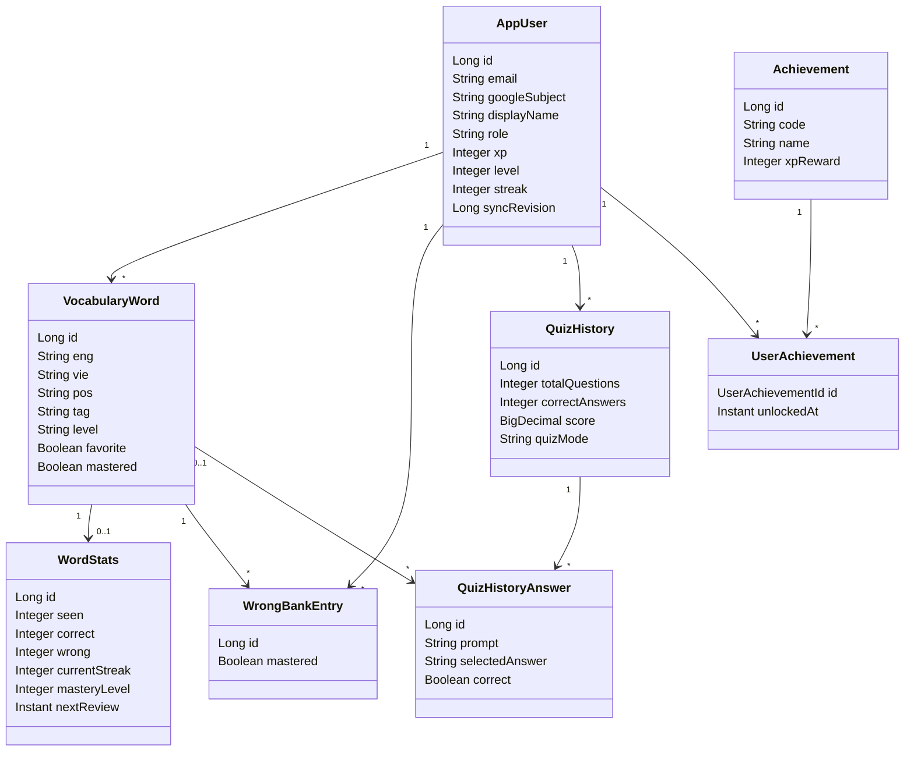
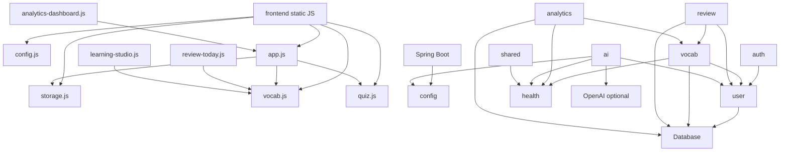

# Project Handover - Diagrams Config And Operations

Historical split from $source lines 1623-2205. Content preserved for reference.

## 13. Class Diagram



## 14. ER Diagram

```mermaid
erDiagram
    APP_USERS ||--o{ VOCABULARY : owns
    VOCABULARY ||--|| WORD_STATS : has
    APP_USERS ||--o{ WRONG_BANK : has
    VOCABULARY ||--o{ WRONG_BANK : appears_in
    APP_USERS ||--o{ QUIZ_HISTORY : takes
    QUIZ_HISTORY ||--o{ QUIZ_HISTORY_ANSWERS : contains
    VOCABULARY ||--o{ QUIZ_HISTORY_ANSWERS : references
    APP_USERS ||--o{ USER_ACHIEVEMENTS : unlocks
    ACHIEVEMENTS ||--o{ USER_ACHIEVEMENTS : defines

    APP_USERS {
      bigint id PK
      varchar email UK
      varchar google_subject UK
      varchar role
      integer xp
      integer level
      bigint sync_revision
      timestamptz created_at
      timestamptz updated_at
    }
    VOCABULARY {
      bigint id PK
      bigint user_id FK
      varchar eng
      varchar vie
      varchar pos
      varchar tag
      varchar word_level
      boolean favorite
      boolean mastered
    }
    WORD_STATS {
      bigint id PK
      bigint word_id FK_UK
      integer seen
      integer correct
      integer wrong
      integer mastery_level
      timestamptz next_review
    }
    WRONG_BANK {
      bigint id PK
      bigint user_id FK
      bigint word_id FK
      boolean mastered
    }
    QUIZ_HISTORY {
      bigint id PK
      bigint user_id FK
      integer total_questions
      integer correct_answers
      numeric score
      varchar quiz_mode
    }
    QUIZ_HISTORY_ANSWERS {
      bigint id PK
      bigint quiz_history_id FK
      bigint word_id FK
      boolean is_correct
    }
    ACHIEVEMENTS {
      bigint id PK
      varchar code UK
      varchar name UK
      integer xp_reward
    }
    USER_ACHIEVEMENTS {
      bigint user_id PK,FK
      bigint achievement_id PK,FK
      timestamptz unlocked_at
    }
```

## 15. Dependency Graph



## 16. Cấu hình

### `application.yml`

Nguồn cấu hình:

- `spring.config.import`: optional `./.env`, `../.env`, `./config/oauth2-google.yml`.
- Google OAuth registration:
  - `client-id`: `${GOOGLE_CLIENT_ID:}`
  - `client-secret`: `${GOOGLE_CLIENT_SECRET:}`
  - `redirect-uri`: `{baseUrl}/login/oauth2/code/{registrationId}`
  - scopes: `openid`, `profile`, `email`
  - provider authorization/token/user-info/jwk/logout URI.
- Session cookie:
  - `server.servlet.session.cookie.same-site=${SESSION_COOKIE_SAME_SITE:lax}`
  - `secure=${SESSION_COOKIE_SECURE:false}`
  - `path=${SESSION_COOKIE_PATH:/}`
- Frontend:
  - `app.frontend.base-url=${FRONTEND_URL:http://localhost:5500/frontend}`
  - `app.frontend.origin=${CORS_ALLOWED_ORIGINS:${FRONTEND_URL:http://127.0.0.1:5500,http://localhost:5500}}`
- OAuth redirect:
  - success: `${app.frontend.base-url}/index.html`
  - logout: `${app.frontend.base-url}/login.html?loggedOut=true`
- AI:
  - enabled by presence of `OPENAI_API_KEY`.
  - model default `gpt-4.1-mini`.
  - responses URL default `https://api.openai.com/v1/responses`.
  - explain/deck minute and daily limits.

### `application.properties`

- App name `quizapp`.
- Datasource default H2, env-overridable `DATABASE_URL`, `DATABASE_USERNAME`, `DATABASE_PASSWORD`.
- `spring.jpa.hibernate.ddl-auto=${JPA_DDL_AUTO:update}`.
- `spring.jpa.open-in-view=false`.
- Flyway disabled default, locations `classpath:db/migration`, validate on migrate true, clean disabled.
- Thymeleaf template check disabled.
- Actuator exposes `health,info`.
- Info app name `WordArena`, version/env from variables.

### Environment variables

Từ `.env.example` và `backend/.env.example`:

- Google: `GOOGLE_CLIENT_ID`, `GOOGLE_CLIENT_SECRET`.
- DB: `DATABASE_URL`, `DATABASE_USERNAME`, `DATABASE_PASSWORD`, `JPA_DDL_AUTO`, `FLYWAY_ENABLED`.
- Frontend/backend: `FRONTEND_URL`, `CORS_ALLOWED_ORIGINS`, `BACKEND_URL`.
- Session: `SESSION_COOKIE_SAME_SITE`, `SESSION_COOKIE_SECURE`, `SESSION_COOKIE_PATH`.
- AI: `OPENAI_API_KEY`, `AI_MODEL`, `OPENAI_RESPONSES_URL`, `AI_EXPLAIN_PER_MINUTE`, `AI_EXPLAIN_PER_DAY`, `AI_DECK_PER_MINUTE`, `AI_DECK_PER_DAY`.
- Release: `APP_VERSION`, `APP_ENV`.

### Frontend config

`frontend/js/config.js`:

- Production backend hardcoded: `https://quiz-app-xd9m.onrender.com`.
- Production frontend detection:
  - `quiz-app-rust-iota-39.vercel.app`
  - `wordarena.org`, `www.wordarena.org`
  - any `.vercel.app`
  - any non-local hostname
- Local backend default: `http://localhost:8080`.

### Docker

`backend/Dockerfile`:

1. Build stage `eclipse-temurin:17-jdk`.
2. Copy Maven wrapper and pom.
3. Run `./mvnw -B dependency:go-offline`.
4. Copy `src`.
5. Run `./mvnw -B clean package -DskipTests`.
6. Runtime stage `eclipse-temurin:17-jre`.
7. Copy jar to `/app/app.jar`.
8. Expose 8080.
9. CMD `java -Dserver.port=${PORT:-8080} -jar app.jar`.

Docker Compose: khĂ´ng cĂ³ file compose trong repository.

### Build/test config

- Backend test: `cd backend; .\mvnw.cmd test`.
- Backend jar: `cd backend; .\mvnw.cmd clean package -DskipTests`.
- Backend run: `cd backend; .\mvnw.cmd spring-boot:run`.
- Frontend smoke: `npm run test:frontend`.
- JS syntax check theo AGENTS khi đổi JS: `node --check frontend\js\...`.

## 17. Logging

Backend dĂ¹ng SLF4J Logger:

- `CurrentUserService`: log warn khi thiếu principal/email, log login/new user/admin access. Email khĂ´ng được log rõ, chỉ user id.
- `VocabularyService`: log snapshot/sync/import/quiz result failures, sync revision conflict, word create/update/delete.
- `LearningAnalyticsService`: log analytics failures vĂ  tăng counter.
- `AiExplanationService`/`AiDeckGeneratorService`: log OpenAI failure rồi fallback.
- `GlobalExceptionHandler`: log validation, malformed request, forbidden, sync conflict, rate limit, runtime exception.
- `StartupDiagnosticsLogger`: log khi app ready vá»›i profile, port, aiEnabled, flywayEnabled.

Frontend logging:

- DĂ¹ng `console.warn`, `console.error` ở cĂ¡c module sync/analytics/review/AI khi fallback hoặc lá»—i.
- Smoke test cĂ³ kiểm tra app load khĂ´ng cĂ³ fatal console errors.

KhĂ´ng thấy cấu hình logging file/JSON/appender riĂªng trong repo. DĂ¹ng logging mặc định Spring Boot console.

## 18. Exception Handling

`GlobalExceptionHandler` xá»­ lĂ½ tập trung:

| Exception | HTTP | Body | Counter |
|---|---:|---|---|
| `MethodArgumentNotValidException` | 400 | `ApiError("Validation failed.", details)` | `validationErrors` |
| `IllegalArgumentException` | 400 | `ApiError(message, [])` | `validationErrors` |
| `HttpMessageNotReadableException` | 400 | `ApiError("Malformed request body.", [])` | `validationErrors` |
| `AccessDeniedException` | 403 | `ApiError("Forbidden.", [message])` | none |
| `SyncRevisionConflictException` | 409 | `SyncConflictResponse` | `syncConflicts` |
| `AiRateLimitExceededException` | 429 | `AiRateLimitError.standard` | none |
| `RuntimeException` | 500 | `ApiError("Something went wrong.", [])` | `serverErrors` |

Service-level counters:

- `VocabularyService.snapshot` increments `snapshotFailures`.
- `VocabularyService.recordQuizResult` increments `quizFailures`.
- `LearningAnalyticsService` increments `analyticsFailures`.
- AI services increment `aiFailures` on OpenAI runtime failure.
- `SpacedRepetitionService.answer` increments `reviewFailures` on runtime failure.

Frontend error handling:

- Auth bootstrap retry `/api/me` theo delay `[500, 1000]`.
- Cloud sync 409 conflict dẫn tới pull snapshot.
- Delete cloud fail Ä‘Æ°a vĂ o queue vá»›i backoff.
- Analytics/review fallback local nếu cloud lỗi.
- AI 429 hiển thị retry-after/cooldown, malformed response dĂ¹ng fallback hoặc khĂ´ng freeze panel.

## 19. Validation

### Backend Bean Validation

| DTO | Validation |
|---|---|
| `ProfileRequest` | `name @Size(max=120)`, `avatar @Size(max=100000)`, `birthday @PastOrPresent`, `gender @Size(max=40)`, `goal @Size(max=160)`, `bio @Size(max=2000)`. |
| `WordRequest` | `id @Positive`, `eng @NotBlank @Size(max=255)`, `vie @NotBlank @Size(max=255)`, `pos @Size(max=50)`, `tag @Size(max=100)`, `ipa @Size(max=120)`, `level @Size(max=40)`, long text fields `@Size(max=2000)`, `stats @Valid`. |
| `WordStatsDto` | counts `@Min(0)`, mastery `@Min(0) @Max(5)`, `lastReviewed @PastOrPresent`; constructor clamps count max 1,000,000 and safe instants. |
| `SyncRequest` | `profile @Valid`, `vocab @Size(max=5000)`, `wrongWords @Size(max=5000)`, each word `@Valid`. |
| `QuizResultRequest` | numeric positive/zero, score 0..10, answers `@NotNull @Size(max=500) @Valid`; constructor clamps numeric ranges. |
| `QuizAnswerRequest` | `eng @NotBlank @Size(max=255)`, `questionMode @Size(max=20)`, `selectedAnswer @Size(max=2000)`, `correctAnswer @NotBlank @Size(max=2000)`. |
| `ReviewAnswerRequest` | `wordId @NotNull @Positive`, `mode @Size(max=40)`. |
| `ExplainWrongAnswerRequest` | `word @NotBlank @Size(max=255)`, `userAnswer @Size(max=2000)`, `correctAnswer @NotBlank @Size(max=2000)`, metadata max sizes. |
| `GenerateDeckRequest` | `text @NotBlank @Size(max=8000)`, `targetLevel @Pattern(any/a1/a2/b1/b2/c1/c2) @Size(max=8)`, `maxWords @Min(1) @Max(30)`. |

### Backend manual validation/business validation

- Duplicate word normalized by English per user.
- `sync` rejects stale `expectedRevision`.
- AI generated deck item guardrails reject blank/placeholder fields and invalid levels.
- `CurrentUserService` rejects missing principal/email.
- `requireAdmin` rejects non-admin role.

### Database constraints

- Not blank checks for vocabulary `eng`, `vie`.
- Non-negative checks for XP/streak/counts.
- Mastery 0..5.
- Score 0..10.
- Unique user/email/google subject, user vocabulary English, wrong bank, achievements.

### Frontend validation

- `vocab.js` requires English and Vietnamese.
- English max length 120 in frontend, stricter than backend max 255.
- Duplicate English by normalized lower-case.
- `learning-studio.js` validates generated/imported deck entries before import.
- AI deck client handles rate limit/malformed without freezing UI.

## 20. Thuật toĂ¡n

### Spaced repetition fixed interval

Actual source dĂ¹ng fixed intervals, khĂ´ng dĂ¹ng SM-2:

```text
wrong -> next review +1 day
correct streak 1 -> +1 day
correct streak 2 -> +3 days
correct streak 3 -> +7 days
correct streak 4 -> +14 days
correct streak >=5 -> +30 days
```

Backend cĂ³ logic trong `LearningProgressService.nextReview` vĂ  `SpacedRepetitionService.nextReview`. Frontend mirror trong `vocab.js` vĂ  `review-today.js`.

### Review queue priority

```text
priority = (5 - mastery) * 8
         + min(30, wrong * 6)
         + min(30, overdueDays * 5)
bounded 0..100
```

### Quiz scoring and XP

- Score client gửi về bị clamp 0..10.
- XP server: `correct * 12 + total * 3 + maxCombo`.
- Level: `floor(xp / 250) + 1`.

### Weak word detection

- Analytics weak word: accuracy < 70 hoặc wrong >= 3.
- Struggling word: reviews >= 3, wrong >= 2, accuracy < 60.
- Frontend dashboard local weak candidate: wrong >=2 hoặc reviews >=3 vĂ  accuracy <70 hoặc overdue chÆ°a mastered.

### Sync merge client-side

- Merge key: server id nếu cĂ³ hoặc normalized English.
- Chọn field theo `updatedAt` giữa local vĂ  cloud.
- Cloud snapshot phải được pull trước push.
- Nếu thiết bị cĂ³ local data, cloud snapshot má»›i hÆ¡n vĂ  last sync quĂ¡ 7 ngĂ y thì block push.
- Delete queue cĂ³ backoff: 0, 30 giĂ¢y, 5 phĂºt, 1 giờ.

### AI JSON guardrails

- Strip markdown code fence.
- Parse JSON trực tiếp.
- Nếu fail, extract object/array candidate giữa dấu mở đầu vĂ  Ä‘Ă³ng cuối cĂ¹ng.
- Validate fields vĂ  length trÆ°á»›c khi trả DTO.

## 21. Hiệu năng

### Query/index tối Æ°u hiện cĂ³

- `idx_vocabulary_user` hỗ trợ list words theo user.
- `idx_vocabulary_user_lower_eng` há»— trợ lookup case-insensitive theo user nếu query tận dụng lower expression. Repository hiện dĂ¹ng derived method `findByUserAndEngIgnoreCase`, Hibernate cĂ³ thể sinh lower comparison.
- `idx_vocabulary_user_tag` há»— trợ lọc theo tag ở DB nếu cĂ³ query tÆ°Æ¡ng ứng. Source hiện nhiều filter tag/level lĂ m trong memory.
- `idx_word_stats_next_review` hỗ trợ due review nếu query trực tiếp theo next_review. Source hiện lấy all user words rồi filter trong Java.
- `idx_quiz_history_user_created` há»— trợ recent history vĂ  weekly history.
- `idx_quiz_answers_history` hỗ trợ load answers theo quiz history.

### Transaction vĂ  locking

- `VocabularyService` dĂ¹ng `@Transactional` ở service class.
- CĂ¡c thao tĂ¡c thay đổi sync-critical lock user bằng `@Lock(PESSIMISTIC_WRITE)` trong `AppUserRepository.findByIdForSyncUpdate`.
- `ReviewController.answer`/service update cũng lock user.
- `AuthController.updateProfile` cĂ³ `@Transactional`.

### Lazy loading

- Entity quan hệ user/word/history dĂ¹ng `FetchType.LAZY` cho nhiều association.
- `spring.jpa.open-in-view=false`, nĂªn service phải map DTO trong transaction. CĂ¡c service hiện lĂ m mapping trong transactional context vá»›i class-level `@Transactional` ở `VocabularyService` vĂ  method transactions ở review/analytics implied by repository reads where needed.

### Cache

- KhĂ´ng cĂ³ server cache layer.
- Health/rate-limit counters lĂ  in-memory state, khĂ´ng phải cache dữ liệu nghiệp vụ.
- Frontend cache chĂ­nh lĂ  `localStorage` account-scoped.

### Batch processing

- `/api/sync` xá»­ lĂ½ batch vocab vĂ  wrongWords tối Ä‘a 5000 item.
- KhĂ´ng thấy JDBC batch config hoặc bulk insert repository trong source.

## 22. Điểm yếu

### Code smell vĂ  technical debt

- Frontend phụ thuá»™c global variables vĂ  thứ tá»± script. `app.js` wrap nhiều hĂ m legacy nhÆ° `save`, `renderTable`, `finishQuiz`, lĂ m coupling cao.
- Nhiều business rule bị nhĂ¢n bản giữa frontend vĂ  backend: spaced repetition interval, stats, weak word logic, sync normalization.
- `archive/` chứa source vĂ  binary cÅ© cĂ³ thể lĂ m nhiá»…u tìm kiếm, audit vĂ  tooling.
- `design-system.css` vĂ  `login-modern.css` tồn tại nhÆ°ng khĂ´ng được load ở app/login hiện tại.
- Backend cĂ³ dependency Thymeleaf vĂ  Lombok nhÆ°ng source hiện khĂ´ng thể hiện nhu cầu rõ rĂ ng.
- `application-oauth.yml` trĂ¹ng cấu hình OAuth vá»›i `application.yml`, cĂ³ nguy cÆ¡ drift.
- Má»™t số chuá»—i tiếng Việt trong Java source hiển thị mojibake trong fallback/starter word code, trong khi curated deck frontend cĂ³ tiếng Việt Ä‘Ăºng dấu.
- `GlobalExceptionHandler` log validation/malformed vá»›i prefix `[AUTH]` dĂ¹ lá»—i khĂ´ng chỉ thuá»™c auth.

### Data/sync risk

- `/api/sync` lĂ  upsert-only theo vocab/wrongWords, khĂ´ng cĂ³ tombstone hoặc danh sĂ¡ch deleted IDs trong payload.
- `sync_revision` bảo vệ push cấp user nhÆ°ng khĂ´ng giải quyết conflict cấp từng word/field.
- Duplicate check service scan toĂ n bá»™ words của user trong Java. DB unique `(user_id, eng)` case-sensitive nĂªn chÆ°a khĂ³a normalized duplicate ở DB.
- Client merge dá»±a trĂªn `updatedAt`; local timestamp do client tạo nĂªn cĂ³ rủi ro clock skew.
- Delete queue nằm localStorage, nếu user clear browser storage thì tombstone pending mất.

### Security risk

- CSRF disabled trong khi app dĂ¹ng session cookie. CORS restricted giĂºp giảm rủi ro cross-origin, nhÆ°ng cookie session thường cần cĂ¢n nhắc CSRF token hoặc SameSite phĂ¹ hợp.
- Admin authorization dá»±a trĂªn string role trong DB, khĂ´ng tĂ­ch hợp Spring authorities.
- AI rate limit in-memory khĂ´ng chia sẻ giữa nhiều instance vĂ  reset khi restart.
- OpenAI API key chỉ backend env, Ä‘Ăºng hÆ°á»›ng. KhĂ´ng thấy key hardcode trong frontend.

### Performance issue

- Review queue vĂ  nhiều analytics lấy toĂ n bá»™ words của user rồi filter/tĂ­nh trong memory. Vá»›i vocab rất lá»›n, nĂªn Ä‘Æ°a due/tag/level query xuống DB.
- Duplicate check tạo stream trĂªn toĂ n bá»™ list words của user.
- `/api/sync` tối Ä‘a 5000 words, nhÆ°ng xá»­ lĂ½ từng item qua repository lookup/save, chÆ°a cĂ³ batch insert/update rõ rĂ ng.
- Frontend render table DOM thủ cĂ´ng toĂ n bá»™ danh sĂ¡ch, chÆ°a cĂ³ virtualization.

### Observability gap

- Health counters reset khi restart, khĂ´ng persistent.
- KhĂ´ng cĂ³ metric timing/histogram hoặc trace.
- KhĂ´ng cĂ³ health counter `syncFailures` trong code dĂ¹ docs hardening cĂ³ nhắc tá»›i.

## 23. Hướng cải tiến

### Refactor

- TĂ¡ch frontend thĂ nh module ES hoặc framework nhẹ, giảm global state vĂ  script-order dependency.
- Đưa business rules shared vĂ o má»™t nÆ¡i rõ rĂ ng hoặc sinh contract từ backend để frontend khĂ´ng tá»± nhĂ¢n bản.
- TĂ¡ch `app.js` thĂ nh cĂ¡c module: auth, sync, dashboard, profile, cloud vocabulary, quiz submit.
- Di chuyển archive cÅ© ra khỏi working source hoặc thĂªm README rõ hÆ¡n cho archive.

### Thiết kế tốt hơn

- Vá»›i backend, giữ layered architecture nhÆ°ng tĂ¡ch sync use case thĂ nh service riĂªng: `SyncService`, `VocabularyCrudService`, `QuizResultService`.
- DĂ¹ng domain event hoặc service method riĂªng cho achievement unlock thay vì đặt trong nhiều luồng.
- DĂ¹ng Spring Security authorities cho admin.
- Chuẩn hĂ³a API error code thay vì chỉ message string.

### Database

- ThĂªm unique index normalized English cho PostgreSQL, vĂ­ dụ `(user_id, lower(btrim(eng)))`, sau khi cleanup duplicate production.
- ThĂªm query repository tối Æ°u:
  - due review theo user vĂ  `next_review <= now`.
  - duplicate lookup normalized.
  - weak words aggregated query nếu dữ liệu lớn.
- CĂ¢n nhắc migration luĂ´n enabled theo mĂ´i trường staging/prod sau baseline an toĂ n.
- Xem xĂ©t tombstone table hoặc `deleted_at` để sync delete Ä‘a thiết bị chắc hÆ¡n.

### API

- ThĂªm endpoint sync delta thay vì snapshot toĂ n bá»™ khi dữ liệu lá»›n.
- ThĂªm ETag/revision per word hoặc `updated_at` server-authoritative.
- ThĂªm direct profile save frontend dĂ¹ng `PUT /api/profile` hoặc bỏ endpoint nếu sync profile lĂ  đường chĂ­nh.
- Chuẩn hĂ³a pagination cho vocab, history, analytics weak words.

### UI

- Virtualize vocabulary table khi số từ lớn.
- TĂ¡ch Learning Studio thĂ nh cĂ¡c component/module nhỏ.
- Chuẩn hĂ³a design-system vĂ  loại CSS khĂ´ng dĂ¹ng.
- ThĂªm trạng thĂ¡i offline/sync conflict rõ hÆ¡n cho user.

### Security/ops

- ÄĂ¡nh giĂ¡ lại CSRF cho session cookie production.
- Chuyển rate limit/counters sang Redis hoặc persistent metrics nếu scale nhiều instance.
- ThĂªm structured logging vĂ  request correlation id.
- Bổ sung alerts cho sync conflict, AI failure, validation spike.

## 24. TĂ³m tắt tĂ¡i tạo dá»± Ă¡n cho AI khĂ¡c

Để tĂ¡i tạo dá»± Ă¡n gần giống source hiện tại:

1. Tạo má»™t static SPA trong `frontend/` bằng HTML/CSS/vanilla JS, khĂ´ng dĂ¹ng bundler. App chĂ­nh lĂ  `index.html`, login lĂ  `login.html`.
2. `index.html` phải load nhiều CSS legacy vĂ  `modern.css`, rồi load cĂ¡c JS theo thứ tá»±: `config`, `storage`, `vocab`, `ui`, `effects`, `timer`, `quiz`, `ai-explain`, `challenge`, `main`, `app`, `curated-decks`, `learning-studio`, `analytics-dashboard`, `review-today`.
3. DĂ¹ng global state `vocab`, `wrongWords`, quiz variables vĂ  account-scoped `localStorage`.
4. Frontend phải local-first: mọi CRUD/quiz/review hoạt Ä‘á»™ng được khi khĂ´ng cĂ³ backend; backend sync lĂ  enhancement khi auth.
5. Tạo backend Spring Boot 3.5.14 Java 17, Maven, package root `com.quizapp`.
6. DĂ¹ng Spring Security OAuth2 Client vá»›i Google, session cookie `JSESSIONID`, `/api/me` public để bootstrap, cĂ¡c API cĂ²n lại authenticated trừ health.
7. Tạo entities JPA: `AppUser`, `VocabularyWord`, `WordStats`, `WrongBankEntry`, `QuizHistory`, `QuizHistoryAnswer`, `Achievement`, `UserAchievement` với schema như mục Database.
8. Tạo repositories Spring Data JPA, trong Ä‘Ă³ `AppUserRepository.findByIdForSyncUpdate` dĂ¹ng pessimistic lock.
9. Tạo `VocabularyService` xá»­ lĂ½ CRUD, sync revision conflict, snapshot, quiz result, XP, achievements vĂ  starter words.
10. Tạo spaced repetition bằng fixed interval 1/3/7/14/30 ngĂ y theo streak, khĂ´ng cần SM-2.
11. Tạo analytics service tĂ­nh overview, trend, weak words, review pressure vĂ  tag/level/quiz mode performance từ repositories.
12. Tạo AI module cĂ³ OpenAI Responses API client optional vĂ  rule-based fallback. Rate limit in-memory theo user/action.
13. Tạo `GlobalExceptionHandler` trả `ApiError`, sync conflict 409 vĂ  AI rate limit 429.
14. Tạo `HealthCounterService` in-memory vĂ  endpoints `/api/health`, `/api/health/summary`.
15. Database production lĂ  PostgreSQL vá»›i `database/schema.sql`; local mặc định H2 in-memory. Flyway migration cĂ³ sẵn nhÆ°ng disabled mặc định.
16. Backend Dockerfile multi-stage dĂ¹ng Eclipse Temurin 17, build jar bằng Maven Wrapper, runtime chạy `java -Dserver.port=${PORT:-8080} -jar app.jar`.
17. Frontend config tự chọn backend origin: local `http://localhost:8080`, production `https://quiz-app-xd9m.onrender.com`.
18. Test frontend bằng Playwright static server mock backend, test cĂ¡c flow load app, CRUD, sync, quiz, review, AI deck. Test backend bằng Spring Boot/JUnit cho spaced repetition, AI, rate limit, analytics, hardening, schema vĂ  health.

TĂ³m lại, dá»± Ă¡n hiện lĂ  má»™t ứng dụng học từ vá»±ng local-first vá»›i backend session OAuth vĂ  đồng bá»™ snapshot/revision. Điểm quan trọng nhất để giữ giống hĂ nh vi hiện tại lĂ  duy trì khả năng chạy offline/localStorage, sau Ä‘Ă³ má»›i sync cloud; giữ fixed-interval review; giữ contract API/DTO; vĂ  khĂ´ng thay đổi luồng Google OAuth/session/CORS nếu khĂ´ng cĂ³ yĂªu cầu cụ thể.
