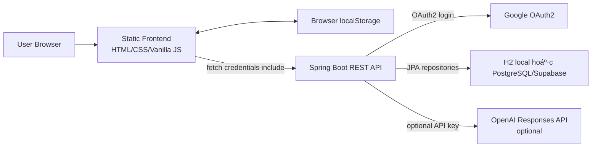

# Project Handover - Overview And Architecture

Historical split from $source lines 1-340. Content preserved for reference.

# TĂ i liệu đặc tả vĂ  bĂ n giao dá»± Ă¡n Quiz App

NgĂ y lập: 2026-07-30  
Phạm vi phĂ¢n tĂ­ch: toĂ n bá»™ source code, cấu hình, database script, test, tĂ i liệu vĂ  thÆ° mục lÆ°u trữ lịch sá»­ trong repository hiện tại.  
NguyĂªn tắc: cĂ¡c nhận định dÆ°á»›i Ä‘Ă¢y dá»±a trĂªn mĂ£ nguồn vĂ  file trong repository. CĂ¡c file nhị phĂ¢n nhÆ° ảnh, Ă¢m thanh, `.class`, `.jar`, `node_modules` được ghi nhận theo vai trĂ² vĂ  vị trĂ­, khĂ´ng giải mĂ£ ná»™i dung nhị phĂ¢n.

## 1. Tổng quan dá»± Ă¡n

### Mục Ä‘Ă­ch dá»± Ă¡n

Quiz App, trong tĂ i liệu vĂ  code cĂ²n dĂ¹ng tĂªn WordArena, lĂ  nền tảng học từ vá»±ng tiếng Anh cĂ³ quiz, Ă´n tập từ sai, thống kĂª tiến Ä‘á»™, spaced repetition, đồng bá»™ cloud khi đăng nhập Google vĂ  fallback local-first khi chÆ°a đăng nhập hoặc backend khĂ´ng khả dụng.

### Chức năng chĂ­nh

- Quản lĂ½ từ vá»±ng: thĂªm, sá»­a, xĂ³a, lọc, Ä‘Ă¡nh dấu yĂªu thĂ­ch, Ä‘Ă¡nh dấu Ä‘Ă£ thuá»™c hoặc khĂ³.
- Học vĂ  quiz: quiz theo chiều Anh sang Việt, Việt sang Anh, mixed, daily challenge, timed challenge, luyện từ sai vĂ  từ yĂªu thĂ­ch.
- Wrong bank: lÆ°u cĂ¡c từ trả lời sai, cho phĂ©p luyện lại vĂ  xĂ³a khỏi danh sĂ¡ch sai.
- Spaced repetition: tĂ­nh lịch Ă´n lại dá»±a trĂªn streak vĂ  kết quả Ä‘Ăºng/sai.
- Analytics: tổng quan học tập, xu hÆ°á»›ng Ä‘á»™ chĂ­nh xĂ¡c, Ă¡p lá»±c Ă´n tập, từ yếu, hiệu suất theo tag vĂ  quiz mode.
- Google OAuth2 login: xĂ¡c thá»±c bằng Google qua Spring Security OAuth2, session cookie `JSESSIONID`.
- Đồng bá»™ dữ liệu cloud: snapshot, sync revision, hĂ ng đợi xĂ³a cloud cục bá»™ vĂ  guard chống ghi đè từ thiết bị cÅ©.
- AI há»— trợ học: giải thĂ­ch cĂ¢u trả lời sai vĂ  sinh deck từ Ä‘oạn văn bằng OpenAI nếu cĂ³ API key, fallback rule-based nếu khĂ´ng cĂ³.
- Hồ sÆ¡ người học: tĂªn, avatar, ngĂ y sinh, giá»›i tĂ­nh, mục tiĂªu, bio, XP, level, streak, achievement.
- Import deck: starter words, curated decks, CSV import, AI generated decks.

### Đối tượng sử dụng

- Người học tiếng Anh muốn tá»± tạo kho từ vá»±ng vĂ  luyện tập.
- Người học cần ứng dụng chạy được cả khi chưa đăng nhập hoặc backend lỗi.
- Người học đăng nhập Google để đồng bá»™ tiến Ä‘á»™ giữa trình duyệt/thiết bị.
- Admin backend cĂ³ role `ADMIN` để import sample words qua endpoint riĂªng.

### Kiến trĂºc tổng thể



Frontend lĂ  static app, quản lĂ½ nhiều state ở global JavaScript vĂ  `localStorage`. Backend lĂ  Spring Boot layered architecture gồm controller, service, repository, entity/DTO. Database chĂ­nh thức theo script PostgreSQL, nhÆ°ng local mặc định dĂ¹ng H2 in-memory vá»›i Hibernate `ddl-auto=update`. Flyway migration cĂ³ sẵn nhÆ°ng disabled mặc định.

## 2. Cấu trĂºc thÆ° mục

### Root

| Đường dẫn | Vai trĂ² |
|---|---|
| `README.md` | TĂ i liệu giá»›i thiệu, cĂ¡ch chạy frontend/backend, OAuth, deploy, endpoint smoke check. |
| `AGENTS.md` | HÆ°á»›ng dẫn cho agent khi lĂ m việc trong repo, gồm cấu trĂºc, lệnh test/build vĂ  quy tắc an toĂ n. |
| `.env.example` | Mẫu biến mĂ´i trường root cho Google OAuth, database, frontend/backend URL, session cookie, OpenAI. |
| `.gitattributes` | Quy tắc Git attributes. |
| `.gitignore` | Loại trừ dependency, build output, env, log, cache. |
| `package.json` | NPM metadata cho smoke test frontend bằng Playwright. |
| `package-lock.json` | Lockfile cho dependency Node. |
| `playwright.config.js` | Cấu hình Playwright, static web server test ở port 4173, project Chromium. |
| `target/` | Build output cục bá»™ của Maven ở root, khĂ´ng phải source runtime hiện tại. |
| `node_modules/` | Dependency Node cục bộ theo `package-lock.json`. |
| `test-results/` | Kết quả test Playwright cục bộ. |

### `frontend/`

| Đường dẫn | Vai trĂ² |
|---|---|
| `frontend/index.html` | App shell chính, chứa dashboard, vocabulary table, quiz screen, review screen, analytics, review today, learning studio overlay, modal profile, audio elements. |
| `frontend/login.html` | Trang đăng nhập Google vĂ  landing/login flow. |
| `frontend/.vscode/settings.json` | Cấu hình Live Server port `5501`. |
| `frontend/css/base.css` | Nền app, font cơ bản, utility `.hidden`. |
| `frontend/css/layout.css` | Layout legacy: container, form/table, quiz section. |
| `frontend/css/components.css` | Button, helper, review, mistakes, combo/effect legacy. |
| `frontend/css/typography.css` | Heading, title, stat typography legacy. |
| `frontend/css/quiz.css` | Giao diện quiz, lựa chọn, progress, timer, challenge. |
| `frontend/css/effects.css` | Animation, particle, firework, shake. |
| `frontend/css/login.css` | Style trang login chĂ­nh. |
| `frontend/css/login-modern.css` | Style login modern, file tồn tại nhưng `login.html` hiện chỉ load `login.css`. |
| `frontend/css/design-system.css` | Token vĂ  component system lá»›n, file tồn tại nhÆ°ng `index.html` hiện khĂ´ng load trá»±c tiếp. |
| `frontend/css/modern.css` | Style app shell hiện tại, theme, dashboard, analytics, studio, profile, responsive. |
| `frontend/js/config.js` | XĂ¡c định backend API origin local/production, expose `window.QUIZ_APP_CONFIG`, `quizApiOrigin`, `quizIsProductionFrontend`. |
| `frontend/js/storage.js` | Account-scoped localStorage, guest/auth migration, `save`, `readLocalArray`, profile cache. |
| `frontend/js/vocab.js` | Model từ vựng local, validate, normalize, CRUD, table render, filters, favorite/mastery/wrong bank local. |
| `frontend/js/ui.js` | Speech synthesis, home navigation, challenge menu, wrong-bank table. |
| `frontend/js/effects.js` | Combo UI, sounds, fireworks, screen shake. |
| `frontend/js/timer.js` | Hint timer vĂ  question timer. |
| `frontend/js/quiz.js` | Quiz engine, daily/timed challenge, answer flow, result/review screen, local word stats. |
| `frontend/js/ai-explain.js` | Client gọi `/api/ai/explain-wrong-answer`, cooldown, fallback local, render explanation panel. |
| `frontend/js/challenge.js` | HĂ m `startChallenge(time)` cho timed challenge. |
| `frontend/js/main.js` | Khởi tạo global state, DOM refs, keyboard handlers, mĂ n hình chĂ­nh. |
| `frontend/js/app.js` | Auth bootstrap, cloud sync, snapshot merge, delete queue, profile UI, dashboard, wrapped legacy functions. |
| `frontend/js/curated-decks.js` | 70 từ curated deck theo topic. |
| `frontend/js/learning-studio.js` | Overlay Learning Studio: profile/history/badges/focus/decks/AI deck/CSV. |
| `frontend/js/analytics-dashboard.js` | Gọi analytics backend hoặc fallback local vĂ  render dashboard/canvas. |
| `frontend/js/review-today.js` | Review Today queue từ backend hoặc fallback local, answer flow. |
| `frontend/js/login.js` | OAuth login page behavior, trạng thĂ¡i query param, check `/api/me`, animation. |
| `frontend/js/theme.js` | Dark/light theme, localStorage theme, toggle labels. |
| `frontend/images/*` | Ảnh UI, favicon, frame animation. |
| `frontend/sounds/*` | Ă‚m thanh combo quiz. |

Thứ tá»± script trong `index.html` rất quan trọng: cĂ¡c file sau phụ thuá»™c global từ file trÆ°á»›c. VĂ­ dụ `app.js` dĂ¹ng vĂ  wrap cĂ¡c hĂ m từ `vocab.js`, `quiz.js`, `storage.js`.

### `backend/`

| Đường dẫn | Vai trĂ² |
|---|---|
| `backend/pom.xml` | Maven project Spring Boot 3.5.14, Java 17, dependency backend. |
| `backend/mvnw`, `backend/mvnw.cmd`, `backend/.mvn/wrapper/*` | Maven Wrapper. |
| `backend/Dockerfile` | Multi-stage Docker build/runtime bằng Eclipse Temurin 17. |
| `backend/.env.example` | Mẫu biến mĂ´i trường backend. |
| `backend/config/oauth2-google.example.yml` | Mẫu file OAuth Google ngoĂ i repo secret. |
| `backend/src/main/resources/application.yml` | OAuth, CORS, session cookie, frontend URL, AI config. |
| `backend/src/main/resources/application.properties` | App name, datasource, JPA, Flyway, actuator info/health. |
| `backend/src/main/resources/application-oauth.yml` | Cấu hình OAuth profile bổ sung, cĂ³ phần trĂ¹ng vá»›i `application.yml`. |
| `backend/src/main/resources/db/migration/V1__baseline_schema.sql` | Migration baseline PostgreSQL. |
| `backend/src/main/resources/db/migration/V2__add_sync_revision.sql` | Migration thĂªm `sync_revision` cho `app_users`. |
| `backend/src/main/java/com/quizapp/QuizApplication.java` | Entry point Spring Boot. |
| `backend/src/main/java/com/quizapp/auth/*` | Auth/profile REST controller. |
| `backend/src/main/java/com/quizapp/config/*` | Security, CORS, AI properties, diagnostics, actuator info. |
| `backend/src/main/java/com/quizapp/user/*` | User entity, repository, profile DTO, current-user service. |
| `backend/src/main/java/com/quizapp/vocab/*` | Vocabulary, sync, quiz history, achievement entity/DTO/repository/service/controller. |
| `backend/src/main/java/com/quizapp/review/*` | Spaced repetition queue/answer controller/service/DTO. |
| `backend/src/main/java/com/quizapp/analytics/*` | Analytics controller/service/DTO/insight service. |
| `backend/src/main/java/com/quizapp/ai/*` | AI explanation/deck generation, OpenAI clients, fallback, rate limit, DTO/error. |
| `backend/src/main/java/com/quizapp/health/*` | Public health endpoints vĂ  in-memory counters. |
| `backend/src/main/java/com/quizapp/shared/*` | API error DTO vĂ  global exception handler. |
| `backend/src/test/java/com/quizapp/*` | Unit/integration tests backend. |

### `database/`

| Đường dẫn | Vai trĂ² |
|---|---|
| `database/schema.sql` | Schema PostgreSQL đầy đủ vĂ  script sá»­a drift cá»™ng dồn: table, constraint, index, trigger, seed achievements. |

### `docs/`

Repo cĂ³ nhiều tĂ i liệu hiện hữu:

- `docs/deploy.md`: hướng dẫn deploy Render/Vercel/Supabase, env, smoke test, Flyway rollout.
- `docs/backend-postgres.md`: chạy backend H2/PostgreSQL vĂ  endpoint summary.
- `docs/oauth-google.md`: cấu hình Google OAuth local/production.
- `docs/product.md`: mĂ´ tả sản phẩm vĂ  roadmap.
- `docs/schema-audit.md`, `docs/production-schema-drift-audit.md`: audit schema production/read-only queries.
- `docs/sync-hardening-audit.md`: audit đồng bộ local/cloud.
- `docs/production-hardening-status.md`: tổng hợp hardening status. Má»™t số Ä‘iểm trong file nĂ y lệch vá»›i source hiện tại, vĂ­ dụ health counter `syncFailures` khĂ´ng tồn tại trong `HealthCounterService`.
- `docs/flyway-baseline-strategy.md`, `docs/flyway-baseline-rehearsal.md`: chiến lược vĂ  rehearsal Flyway baseline.
- `docs/ui-before-after-checklist.md`, `docs/ui-video-comparison-plan.md`, `docs/ui-audit-evidence/`: Ä‘ang lĂ  untracked files trong working tree khi lập tĂ i liệu nĂ y, khĂ´ng được thay đổi trong quĂ¡ trình phĂ¢n tĂ­ch.

### `tests/`

| Đường dẫn | Vai trĂ² |
|---|---|
| `tests/static-server.mjs` | Static file server cho Playwright, phục vụ repo ở `http://127.0.0.1:4173/frontend/`. |
| `tests/smoke.spec.js` | Smoke tests frontend, mock backend, kiểm tra app load, onboarding, navigation, CRUD, sync conflict, delete queue, quiz, review queue, AI deck, curated decks. |

### `archive/`

`archive/phase1-20260513-013125/` chứa snapshot lịch sử trước phase 1:

- `README-before-phase1.md`.
- `frontend-duplicate-before-phase1-remaining/`: bản frontend cÅ© vĂ  má»™t số scaffold backend lồng bĂªn trong.
- `backend-generated-before-phase1-remaining/`: backend Spring cũ package `com.quiz`.
- `frotend-nested-spring-app/`: scaffold Spring lồng trong thư mục bị typo.
- `root-target-before-phase1-remaining/`: compiled classes cũ.

ThÆ° mục nĂ y khĂ´ng được load bởi frontend/backend hiện tại, nhÆ°ng dá»… lĂ m nhiá»…u khi tìm kiếm vì chứa source vĂ  binary cÅ©.

### Kiểm kĂª source file Ä‘Ă£ phĂ¢n tĂ­ch

CĂ¡c dependency/build artifact nhÆ° `node_modules/`, `target/`, `backend/target/` vĂ  file `.class` trong `archive/` được ghi nhận lĂ  artifact sinh ra hoặc dependency ngoĂ i, khĂ´ng coi lĂ  source nghiệp vụ hiện tại. CĂ¡c source/config/test chĂ­nh dÆ°á»›i Ä‘Ă¢y Ä‘Ă£ được kiểm kĂª trong quĂ¡ trình lập tĂ i liệu.

#### Backend main Java

| Package | File |
|---|---|
| `com.quizapp` | `QuizApplication.java` |
| `com.quizapp.auth` | `AuthController.java` |
| `com.quizapp.config` | `SecurityConfig.java` |
| `com.quizapp.health` | `HealthController.java`, `HealthCounterService.java`, `StartupDiagnosticsLogger.java`, `WordArenaInfoContributor.java` |
| `com.quizapp.shared` | `ApiError.java`, `GlobalExceptionHandler.java` |
| `com.quizapp.user` | `AppUser.java`, `AppUserRepository.java`, `CurrentUserService.java`, `ProfileDto.java`, `ProfileRequest.java` |
| `com.quizapp.vocab` | `Achievement.java`, `AchievementDto.java`, `AchievementRepository.java`, `AchievementService.java`, `LearningProgressService.java`, `ProgressSummaryDto.java`, `QuizAnswerRequest.java`, `QuizHistory.java`, `QuizHistoryAnswer.java`, `QuizHistoryDto.java`, `QuizHistoryRepository.java`, `QuizResultRequest.java`, `SyncConflictResponse.java`, `SyncRequest.java`, `SyncResponse.java`, `SyncRevisionConflictException.java`, `UserAchievement.java`, `UserAchievementId.java`, `UserAchievementRepository.java`, `VocabularyController.java`, `VocabularyRepository.java`, `VocabularyService.java`, `VocabularyWord.java`, `WordDto.java`, `WordRequest.java`, `WordStats.java`, `WordStatsDto.java`, `WrongBankEntry.java`, `WrongBankRepository.java` |
| `com.quizapp.review` | `ReviewAnswerRequest.java`, `ReviewAnswerResponse.java`, `ReviewController.java`, `ReviewQueueItemDto.java`, `SpacedRepetitionService.java` |
| `com.quizapp.analytics` | `AccuracyTrendDto.java`, `AnalyticsOverviewDto.java`, `LearningAnalyticsController.java`, `LearningAnalyticsService.java`, `LearningInsightDto.java`, `LearningInsightService.java`, `PerformanceMetricDto.java`, `ReviewPressureDto.java`, `TagPerformanceDto.java`, `WeakWordDto.java` |
| `com.quizapp.ai` | `AiDeckGeneratorClient.java`, `AiDeckGeneratorController.java`, `AiDeckGeneratorService.java`, `AiExplanationClient.java`, `AiExplanationController.java`, `AiExplanationService.java`, `AiJsonGuardrails.java`, `AiRateLimitAction.java`, `AiRateLimitError.java`, `AiRateLimitExceededException.java`, `AiRateLimitProperties.java`, `AiRateLimitService.java`, `ExplainWrongAnswerRequest.java`, `ExplainWrongAnswerResponse.java`, `GeneratedDeckResponse.java`, `GeneratedDeckWordDto.java`, `GenerateDeckRequest.java`, `OpenAiDeckGeneratorClient.java`, `OpenAiExplanationClient.java`, `RuleBasedDeckGeneratorService.java`, `RuleBasedExplanationService.java` |

#### Backend resource/test/build files

| NhĂ³m | File |
|---|---|
| Backend config/resource | `application.yml`, `application.properties`, `application-oauth.yml`, `db/migration/V1__baseline_schema.sql`, `db/migration/V2__add_sync_revision.sql` |
| Backend project/build | `pom.xml`, `Dockerfile`, `.env.example`, `config/oauth2-google.example.yml`, Maven Wrapper files |
| Backend tests | `AiDeckGeneratorFallbackTests.java`, `AiDeckGeneratorTests.java`, `AiExplanationFallbackTests.java`, `AiExplanationTests.java`, `AiRateLimitTests.java`, `BackendHardeningTests.java`, `DatabaseSchemaTests.java`, `HealthCheckTests.java`, `LearningAnalyticsTests.java`, `OpenAiClientGuardrailTests.java`, `QuizApplicationTests.java`, `SpacedRepetitionTests.java` |

#### Frontend, database, docs vĂ  tests

| NhĂ³m | File |
|---|---|
| Frontend HTML | `frontend/index.html`, `frontend/login.html` |
| Frontend CSS | `base.css`, `components.css`, `design-system.css`, `effects.css`, `layout.css`, `login.css`, `login-modern.css`, `modern.css`, `quiz.css`, `typography.css` |
| Frontend JS | `ai-explain.js`, `analytics-dashboard.js`, `app.js`, `challenge.js`, `config.js`, `curated-decks.js`, `effects.js`, `learning-studio.js`, `login.js`, `main.js`, `quiz.js`, `review-today.js`, `storage.js`, `theme.js`, `timer.js`, `ui.js`, `vocab.js` |
| Frontend assets | `images/quiz.jpg`, `icon.png`, `family.jpg`, `frame1.png` tá»›i `frame10.png`, favicon PNG/ICO/manifest, `sounds/combo_x1_x3_x5.mp3`, `combo_x10_x20_x30.mp3`, `combo_x50.mp3`, `combo_x100.mp3` |
| Database | `database/schema.sql` |
| Test frontend | `tests/static-server.mjs`, `tests/smoke.spec.js` |
| Existing docs | `backend-postgres.md`, `deploy.md`, `flyway-baseline-rehearsal.md`, `flyway-baseline-strategy.md`, `oauth-google.md`, `product.md`, `production-hardening-status.md`, `production-schema-drift-audit.md`, `schema-audit.md`, `sync-hardening-audit.md` |
| UI audit files hiện cĂ³ | `ui-before-after-checklist.md`, `ui-video-comparison-plan.md`, `ui-audit-evidence/*` |
| Archive source snapshot | CĂ¡c file dÆ°á»›i `archive/phase1-20260513-013125/` gồm backend cÅ© package `com.quiz`, frontend duplicate cÅ©, nested Spring app typo `frotend-nested-spring-app`, Maven wrapper/pom cÅ©, assets cÅ© vĂ  compiled classes cÅ©. |

## 3. CĂ´ng nghệ sá»­ dụng

### NgĂ´n ngữ

| ThĂ nh phần | NgĂ´n ngữ |
|---|---|
| Frontend | HTML, CSS, JavaScript vanilla |
| Backend | Java 17 |
| Database | SQL PostgreSQL, H2 local compatibility |
| Test frontend | JavaScript Playwright |
| Build/runtime scripts | PowerShell/CMD wrapper, Dockerfile |

### Framework, library, dependency vĂ  version

Backend từ `backend/pom.xml`:

| Dependency | Version | Scope | Vai trĂ² |
|---|---:|---|---|
| Spring Boot parent | 3.5.14 | parent | Quản lĂ½ version Spring stack. |
| Java | 17 | property | Runtime vĂ  compile target. |
| `spring-boot-starter-web` | theo Boot 3.5.14 | compile | REST API MVC. |
| `spring-boot-starter-data-jpa` | theo Boot 3.5.14 | compile | JPA/Hibernate repository/entity. |
| `spring-boot-starter-security` | theo Boot 3.5.14 | compile | Security filter chain/session auth. |
| `spring-boot-starter-oauth2-client` | theo Boot 3.5.14 | compile | Google OAuth2 client. |
| `spring-boot-starter-validation` | theo Boot 3.5.14 | compile | Jakarta Bean Validation cho DTO. |
| `spring-boot-starter-actuator` | theo Boot 3.5.14 | compile | Health/info endpoints. |
| `spring-boot-starter-thymeleaf` | theo Boot 3.5.14 | compile | CĂ³ trong dependency, khĂ´ng thấy template runtime chĂ­nh trong source. |
| `thymeleaf-extras-springsecurity6` | theo Boot 3.5.14 | compile | CĂ³ trong dependency, chÆ°a thấy dĂ¹ng trá»±c tiếp. |
| `org.postgresql:postgresql` | theo Boot BOM | runtime | PostgreSQL driver. |
| `com.h2database:h2` | theo Boot BOM | runtime | Local in-memory DB. |
| `org.flywaydb:flyway-core` | theo Boot BOM | compile | Migration support. |
| `org.flywaydb:flyway-database-postgresql` | theo Boot BOM | runtime | Flyway PostgreSQL adapter. |
| `org.projectlombok:lombok` | theo Boot BOM | optional | CĂ³ dependency vĂ  annotation processor, source hiện chủ yếu dĂ¹ng explicit code/record. |
| `spring-boot-devtools` | theo Boot BOM | runtime optional | Local development. |
| `spring-boot-starter-test` | theo Boot BOM | test | Backend tests. |
| `spring-security-test` | theo Boot BOM | test | Security tests. |

Frontend/test từ `package.json`:

| Dependency | Version | Vai trĂ² |
|---|---:|---|
| `@playwright/test` | `^1.60.0` | Frontend smoke tests. |

Build tool:

- Backend: Maven Wrapper (`backend/mvnw.cmd`, `backend/pom.xml`).
- Frontend: static files, khĂ´ng cĂ³ bundler. Playwright dĂ¹ng Node chỉ để test.
- Docker: `backend/Dockerfile`.
- Docker Compose: khĂ´ng tìm thấy file `docker-compose.yml` hoặc tÆ°Æ¡ng Ä‘Æ°Æ¡ng trong repo.

Database:

- Local mặc định: H2 in-memory `jdbc:h2:mem:quizapp;MODE=PostgreSQL;DATABASE_TO_LOWER=TRUE`.
- Production mục tiĂªu: PostgreSQL/Supabase theo `database/schema.sql` vĂ  docs deploy.

## 4. Kiến trĂºc

### Backend architecture

Backend dĂ¹ng layered architecture theo Spring MVC:

```text
HTTP Request
-> Spring Security Filter Chain
-> Controller
-> CurrentUserService nếu endpoint cần user hiện tại
-> Service nghiệp vụ
-> Repository Spring Data JPA
-> Entity/Hibernate
-> Database
```

KhĂ´ng thấy Clean Architecture strict vá»›i use case port/adapter Ä‘á»™c lập. Code tổ chức theo module domain/package, má»—i module cĂ³ controller/service/repository/entity/DTO.

### MVC vĂ  REST

- Controller nhận request vĂ  trả DTO/record/map.
- Service chứa business logic, transaction, sync, analytics, spaced repetition, AI fallback.
- Repository kế thừa `JpaRepository`, chứa query method vĂ  má»™t số JPQL.
- Entity Ă¡nh xạ table bằng JPA annotation.

### Dependency Injection

ToĂ n bá»™ service/controller/config dĂ¹ng constructor injection:

- `VocabularyController` inject `VocabularyService`, `CurrentUserService`.
- `VocabularyService` inject repositories, `LearningProgressService`, `AchievementService`, `HealthCounterService`.
- `SecurityConfig` inject `AppProperties`.
- AI services inject client, fallback, rate limit, properties/counter.

Bean lifecycle:

- `QuizApplication.main` chạy `SpringApplication.run`.
- Spring Boot auto-configures MVC, Security, JPA, Actuator.
- `StartupDiagnosticsLogger` lắng nghe `ApplicationReadyEvent` vĂ  log trạng thĂ¡i cấu hình.
- JPA entity lifecycle dĂ¹ng `@PrePersist`, `@PreUpdate` để set timestamp.

### Frontend architecture

Frontend lĂ  single-page static app khĂ´ng dĂ¹ng framework. State chĂ­nh nằm trong biến global vĂ  `localStorage`.

```text
index.html
-> load CSS
-> load JS theo thứ tự cố định
-> main.js tạo global DOM/state
-> vocab.js/quiz.js/ui.js định nghÄ©a hĂ m nghiệp vụ UI
-> app.js bootstrap auth/cloud sync vĂ  wrap cĂ¡c hĂ m legacy
-> analytics/review/studio module gắn API vĂ o window
```

KhĂ´ng cĂ³ router framework. Routing ná»™i bá»™ lĂ  show/hide page qua `data-app-page` vĂ  `window.showAppPage`.

### Quan hệ giữa cĂ¡c module backend

- `auth` phụ thuộc `user`.
- `vocab` phụ thuộc `user`, `health`.
- `review` phụ thuộc `user`, `vocab`, `health`.
- `analytics` phụ thuộc `vocab`, `user`, `health`.
- `ai` phụ thuộc `user`, `config`, `health`.
- `shared` phụ thuộc `health`.
- `config` phụ thuá»™c `user` cho actuator info vĂ  security.

