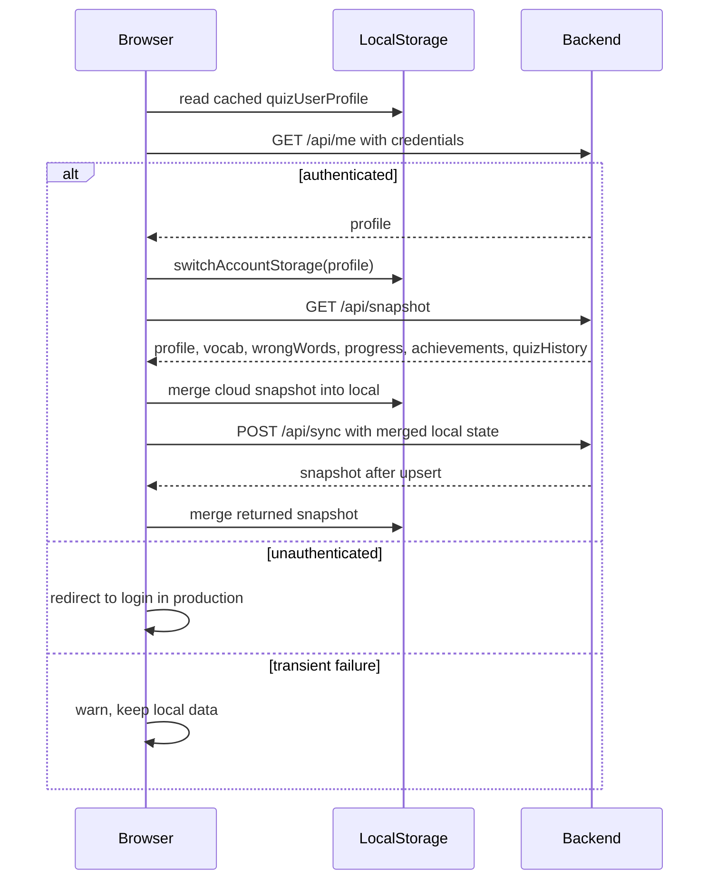
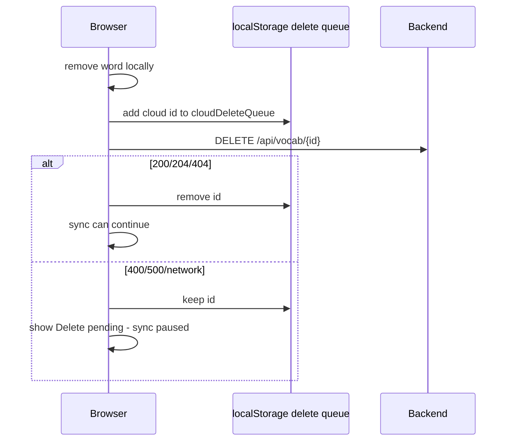

# Sync Hardening Audit Original - Architecture

Historical split from $source lines 1-457. Content preserved for reference.

# WordArena Sync Hardening Audit

Date: 2026-06-08

Update: 2026-07-30 - P0 business integrity lockdown changed the backend trust
boundary for quiz and sync progress data. `/api/quiz-results` now recomputes
totals, correctness, score, combo, XP, stats, wrong-bank state, and
score-driven achievements from server-owned vocabulary answers. `/api/sync`,
`POST /api/vocab`, `PUT /api/vocab/{id}`, starter import, and wrong-word sync
continue to accept editable word content, but ignore client-supplied
`mastered`, `stats`, and wrong-bank mastery/progress fields. Sections below
describe the original audit; where they mention client stats overwriting server
stats, that behavior has been superseded by the July 30 lockdown.

## Scope

This is an audit-first reliability review of WordArena sync behavior. No sync code, storage format, backend API contract, database schema, or production data was changed.

The goal is to answer: can WordArena preserve user vocabulary data safely under real production conditions?

Short answer: the current architecture is salvageable for a focused learning app, but it is not a true multi-device conflict system. It is local-first with cloud snapshot/upsert behavior, a per-account localStorage namespace, and a separate pending delete queue. The most important risks are stale client overwrite, timestamp trust, delete queue/account coupling, and offline review progress conflict.

## Files Audited

Frontend:

- `frontend/js/app.js`
- `frontend/js/storage.js`
- `frontend/js/vocab.js`
- `frontend/js/review-today.js`
- `frontend/js/analytics-dashboard.js`
- `frontend/js/learning-studio.js`
- `frontend/js/config.js`

Backend:

- `backend/src/main/java/com/quizapp/vocab/VocabularyController.java`
- `backend/src/main/java/com/quizapp/vocab/VocabularyService.java`
- `backend/src/main/java/com/quizapp/vocab/SyncRequest.java`
- `backend/src/main/java/com/quizapp/vocab/SyncResponse.java`
- `backend/src/main/java/com/quizapp/vocab/WordRequest.java`
- `backend/src/main/java/com/quizapp/vocab/WordDto.java`
- `backend/src/main/java/com/quizapp/vocab/WordStatsDto.java`
- `backend/src/main/java/com/quizapp/review/ReviewController.java`
- `backend/src/main/java/com/quizapp/review/SpacedRepetitionService.java`

## Current Sync Architecture

WordArena uses local-first storage and cloud sync when authenticated.

High-level model:

- Frontend local data lives in `localStorage`.
- Account data is scoped by email using `quizAccount:<accountId>:<key>`.
- Production auth is session-based through backend Google OAuth and `JSESSIONID`.
- Frontend verifies auth with `GET /api/me`.
- Frontend pulls cloud state with `GET /api/snapshot`.
- Frontend pushes cloud state with `POST /api/sync`.
- Individual frontend create/update/delete operations also try direct cloud APIs.
- Deletes use `DELETE /api/vocab/{id}` and a local pending delete queue.
- Backend `/api/sync` upserts words by normalized English, not by client revision.

## Sequence Flow

### App Startup And Login

Important code:

- `frontend/js/app.js`: `fetchCurrentUserWithRetry`, `loadAuthenticatedProfile`, `pullCloudSnapshot`, `syncCloudNow`
- `frontend/js/storage.js`: `switchAccountStorage`, `save`, `accountStorageKey`

### First Cloud Sync After Login

Flow:

1. `loadAuthenticatedProfile()` authenticates with `/api/me`.
2. `cloudSyncReady = true`.
3. `pullCloudSnapshot()` runs before the first push.
4. `applyServerSnapshot()` merges cloud words into local lists.
5. If pull succeeds, `syncCloudNow()` pushes merged local state to `/api/sync`.

Reliability implication:

- A fresh empty browser is unlikely to wipe cloud state immediately because initial sync pulls before pushing.
- If snapshot fails, `syncCloudNow()` is not called from the login path.
- Later UI-triggered sync calls can still push whatever is local once `cloudSyncReady` is true.

### Local Save

Flow:

1. Local operations modify global `vocab` and `wrongWords`.
2. `save()` writes to account-scoped `localStorage`.
3. UI rerenders.
4. Cloud write is attempted if `window.quizCloud` is ready.

Important code:

- `frontend/js/storage.js`: `save()`
- `frontend/js/vocab.js`: add/edit/delete/favorite/known/hard flows
- `frontend/js/review-today.js`: `persistLocalWords()`
- `frontend/js/learning-studio.js`: `importWordsToVocabulary()`

### Cloud Snapshot Pull

Flow:

1. `pullCloudSnapshot()` first calls `flushPendingCloudDeletes()`.
2. If delete queue cannot flush, snapshot pull stops.
3. Frontend fetches `/api/snapshot`.
4. Snapshot is merged into local state with `mergeWordLists()`.
5. LocalStorage is saved.

Merge direction:

- Local list is loaded first into a `Map`.
- Cloud words are then merged by normalized English key.
- For matching words, `chooseMergedWord(local, cloud)` picks based on `updatedAt`, `updated_at`, `stats.lastReviewed`, or `stats.nextReview`.
- If timestamps tie or both missing, cloud wins.

### Cloud Push

Flow:

1. `syncCloudNow()` first calls `flushPendingCloudDeletes()`.
2. If deletes remain, sync stops.
3. Frontend sends profile, all vocab, and all wrongWords to `/api/sync`.
4. Backend applies profile.
5. Backend upserts every vocabulary item by normalized English.
6. Backend upserts wrong-bank entries by normalized English and sets mastered state.
7. Backend returns a full snapshot.
8. Frontend merges returned snapshot.

Backend merge direction:

- `/api/sync` does not compare timestamps.
- Last request processed by the server wins for all fields of each normalized English word.
- Deletes are not represented in `/api/sync`.

### Delete Flow

Important code:

- `frontend/js/app.js`: `cloudDeleteQueueKey`, `readPendingCloudDeletes`, `writePendingCloudDeletes`, `queuePendingCloudDelete`, `flushPendingCloudDeletes`, `deleteCloudWord`
- `frontend/js/vocab.js`: `deleteWord`
- `backend VocabularyService.deleteWord`: idempotent own-user delete, no cross-user delete

Current backend behavior is now safe for stale/missing IDs:

- If the word exists for the current user, delete it.
- If the word does not exist for the current user, return success/no error.
- This prevents stale delete IDs from blocking sync forever because of missing backend rows.

## Sync Entry Points

### Auth Bootstrap

Trigger source:

- App load.

Frontend path:

- `loadAuthenticatedProfile()`
- `fetchCurrentUserWithRetry()`
- `/api/me`

Local writes:

- Applies cached profile in local/dev mode.
- Switches account storage after authenticated profile.

Cloud writes:

- None directly, but successful auth triggers snapshot pull and then sync push.

Failure handling:

- 401/403 or `authenticated:false`: production redirects to login.
- 500/network/transient: retries, then warns without clearing local data.

Risk:

- Low/medium. Recent retry behavior makes false logout less likely.

### Snapshot Pull

Trigger source:

- Successful login.
- `scheduleCloudSync()` when `cloudSnapshotPulled` is false.
- Manual `window.quizCloud.pullNow`.

Local writes:

- Merges cloud vocab/wrongWords into local.
- Saves localStorage.
- Applies profile/progress/achievements.

Cloud writes:

- None.

Overwrite rules:

- Per-word merge by normalized English.
- Newer timestamp wins; cloud wins ties/missing timestamps.

Failure handling:

- Non-ok response sets "Cloud unavailable".
- Network error sets "Offline/local mode".
- Pending delete queue blocks pull.

Risk:

- Medium. Pull itself is conservative, but merge can prefer stale cloud if local timestamp is missing or invalid.

### Full Cloud Sync Push

Trigger source:

- After successful initial snapshot pull.
- Debounced local changes through `scheduleCloudSync()`.
- Manual Studio sync button.
- Imports and Learning Studio imports.

Local writes:

- Merges returned server snapshot back into local.

Cloud writes:

- Sends all local vocab and wrongWords to `/api/sync`.

Overwrite rules:

- Backend upserts by normalized English.
- Backend does not compare client and server timestamps.
- Every incoming word request can overwrite existing server fields.

Failure handling:

- Non-ok response sets "Cloud unavailable".
- Network error sets "Offline/local mode".
- Pending delete queue blocks sync.

Risk:

- High for multi-device stale overwrite. This is the biggest architectural risk in the current sync model.

### Direct Cloud Create

Trigger source:

- Adding a word while cloud ready.

Cloud writes:

- `POST /api/vocab`.

Overwrite/duplicate rules:

- Backend normalizes English whitespace and rejects duplicates case-insensitively.

Failure handling:

- Returns null on failure; local save remains.

Risk:

- Low/medium. Local-first behavior is safe, but failed creates rely on later full sync to reconcile.

### Direct Cloud Update

Trigger source:

- Editing fields, toggling favorite, marking known/hard.

Cloud writes:

- `PUT /api/vocab/{id}` if the local word has a server id.

Overwrite rules:

- Backend updates the word found by id and user.
- Duplicate English is rejected.

Failure handling:

- Returns null on failure; local save remains.

Risk:

- Medium. If PUT fails, later `/api/sync` may upsert by English and overwrite cloud based on local state.

### Direct Cloud Delete

Trigger source:

- Deleting a word in vocabulary table.

Local writes:

- Removes local vocab immediately.
- Removes matching wrongWords by English.
- Adds server id to delete queue.

Cloud writes:

- `DELETE /api/vocab/{id}`.

Failure handling:

- Queue persists until success, 404, or now idempotent backend success.
- Any remaining queue pauses snapshot and sync.

Risk:

- Medium. Backend idempotency fixed the worst stuck state. Remaining risk is account-switch queue ambiguity and no max retry/diagnostic metadata.

### Review Queue Fetch

Trigger source:

- Opening review screen or review refresh.

Cloud reads:

- `GET /api/review/queue?limit=8`.

Local writes:

- None on fetch.

Failure handling:

- Falls back to local due queue.

Risk:

- Low for availability, medium for consistency because cloud/local queues can diverge.

### Review Answer

Trigger source:

- User answers review item.

Cloud writes:

- If source is cloud, sends `POST /api/review/answer`.

Local writes:

- Always applies local stats update through `applyLocalAnswer()`.

Failure handling:

- If cloud answer fails, local progress is saved and the user sees a warning.

Risk:

- High for offline review conflict. Local review progress can later be pushed through full sync and overwrite newer cloud stats because there is no server revision or monotonic review event log.

### Analytics

Trigger source:

- Dashboard/analytics refresh.

Cloud reads:

- `/api/analytics/overview`
- `/api/analytics/accuracy-trend`
- `/api/analytics/weak-words`
- `/api/analytics/review-pressure`
- `/api/analytics/tag-performance`

Local writes:

- None.

Failure handling:

- Falls back to local analytics.

Risk:

- Low for data safety. Analytics may show different cloud/local results during sync instability.

### Imports And AI Deck Imports

Trigger source:

- JSON import, starter import, CSV import, AI deck import.

Local writes:

- Merge or replace current local vocabulary.
- Stamps imported words with client `updatedAt`.

Cloud writes:

- Calls `syncCloudNow()` or admin sample import.

Overwrite rules:

- Merge mode skips duplicates by normalized English.
- Replace mode replaces local data, then later sync can push replaced local state upward. Because `/api/sync` does not delete missing cloud words, replace mode does not truly remove cloud words unless deletes happen separately.

Risk:

- Medium. Merge mode is safer than replace. Replace language may imply cloud replacement, but backend sync is upsert-only.

