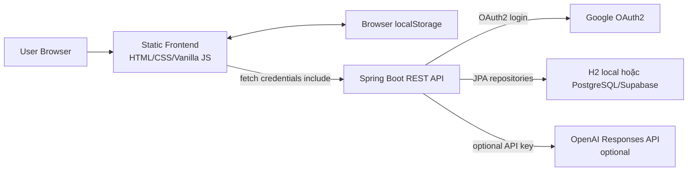
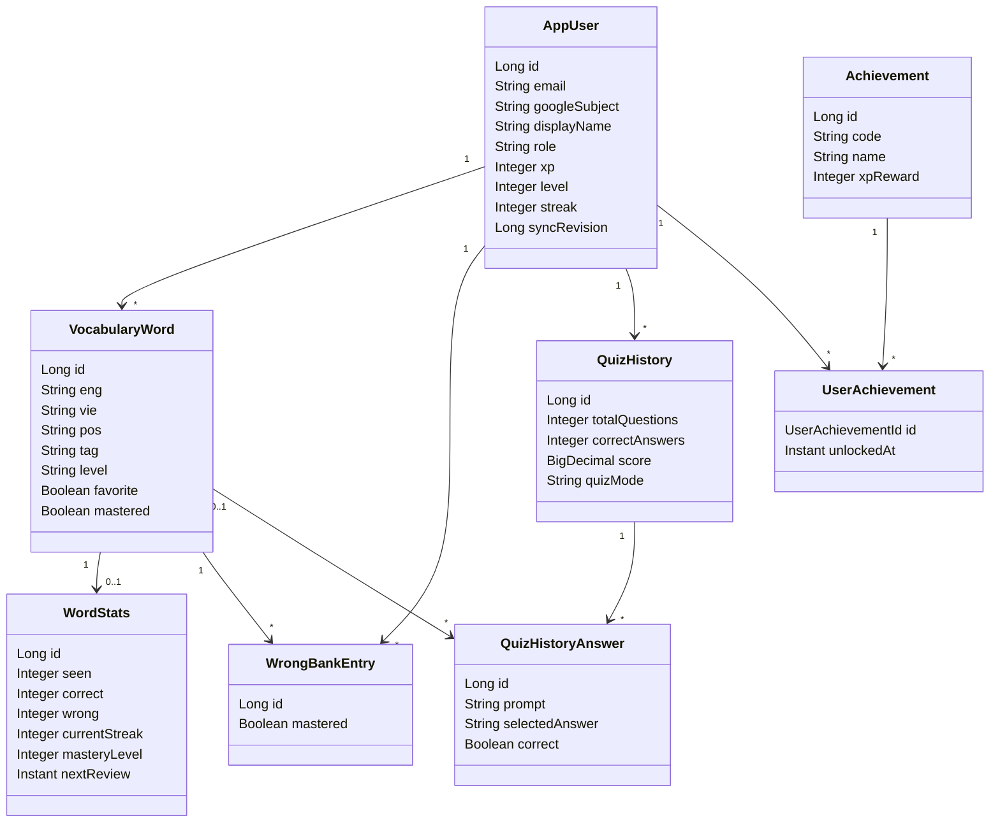
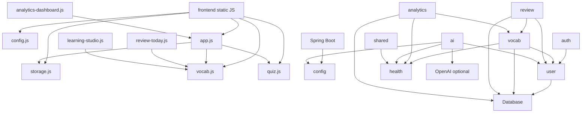

# Tài liệu đặc tả và bàn giao dự án Quiz App

Ngày lập: 2026-07-30  
Phạm vi phân tích: toàn bộ source code, cấu hình, database script, test, tài liệu và thư mục lưu trữ lịch sử trong repository hiện tại.  
Nguyên tắc: các nhận định dưới đây dựa trên mã nguồn và file trong repository. Các file nhị phân như ảnh, âm thanh, `.class`, `.jar`, `node_modules` được ghi nhận theo vai trò và vị trí, không giải mã nội dung nhị phân.

## 1. Tổng quan dự án

### Mục đích dự án

Quiz App, trong tài liệu và code còn dùng tên WordArena, là nền tảng học từ vựng tiếng Anh có quiz, ôn tập từ sai, thống kê tiến độ, spaced repetition, đồng bộ cloud khi đăng nhập Google và fallback local-first khi chưa đăng nhập hoặc backend không khả dụng.

### Chức năng chính

- Quản lý từ vựng: thêm, sửa, xóa, lọc, đánh dấu yêu thích, đánh dấu đã thuộc hoặc khó.
- Học và quiz: quiz theo chiều Anh sang Việt, Việt sang Anh, mixed, daily challenge, timed challenge, luyện từ sai và từ yêu thích.
- Wrong bank: lưu các từ trả lời sai, cho phép luyện lại và xóa khỏi danh sách sai.
- Spaced repetition: tính lịch ôn lại dựa trên streak và kết quả đúng/sai.
- Analytics: tổng quan học tập, xu hướng độ chính xác, áp lực ôn tập, từ yếu, hiệu suất theo tag và quiz mode.
- Google OAuth2 login: xác thực bằng Google qua Spring Security OAuth2, session cookie `JSESSIONID`.
- Đồng bộ dữ liệu cloud: snapshot, sync revision, hàng đợi xóa cloud cục bộ và guard chống ghi đè từ thiết bị cũ.
- AI hỗ trợ học: giải thích câu trả lời sai và sinh deck từ đoạn văn bằng OpenAI nếu có API key, fallback rule-based nếu không có.
- Hồ sơ người học: tên, avatar, ngày sinh, giới tính, mục tiêu, bio, XP, level, streak, achievement.
- Import deck: starter words, curated decks, CSV import, AI generated decks.

### Đối tượng sử dụng

- Người học tiếng Anh muốn tự tạo kho từ vựng và luyện tập.
- Người học cần ứng dụng chạy được cả khi chưa đăng nhập hoặc backend lỗi.
- Người học đăng nhập Google để đồng bộ tiến độ giữa trình duyệt/thiết bị.
- Admin backend có role `ADMIN` để import sample words qua endpoint riêng.

### Kiến trúc tổng thể



Frontend là static app, quản lý nhiều state ở global JavaScript và `localStorage`. Backend là Spring Boot layered architecture gồm controller, service, repository, entity/DTO. Database chính thức theo script PostgreSQL, nhưng local mặc định dùng H2 in-memory với Hibernate `ddl-auto=update`. Flyway migration có sẵn nhưng disabled mặc định.

## 2. Cấu trúc thư mục

### Root

| Đường dẫn | Vai trò |
|---|---|
| `README.md` | Tài liệu giới thiệu, cách chạy frontend/backend, OAuth, deploy, endpoint smoke check. |
| `AGENTS.md` | Hướng dẫn cho agent khi làm việc trong repo, gồm cấu trúc, lệnh test/build và quy tắc an toàn. |
| `.env.example` | Mẫu biến môi trường root cho Google OAuth, database, frontend/backend URL, session cookie, OpenAI. |
| `.gitattributes` | Quy tắc Git attributes. |
| `.gitignore` | Loại trừ dependency, build output, env, log, cache. |
| `package.json` | NPM metadata cho smoke test frontend bằng Playwright. |
| `package-lock.json` | Lockfile cho dependency Node. |
| `playwright.config.js` | Cấu hình Playwright, static web server test ở port 4173, project Chromium. |
| `target/` | Build output cục bộ của Maven ở root, không phải source runtime hiện tại. |
| `node_modules/` | Dependency Node cục bộ theo `package-lock.json`. |
| `test-results/` | Kết quả test Playwright cục bộ. |

### `frontend/`

| Đường dẫn | Vai trò |
|---|---|
| `frontend/index.html` | App shell chính, chứa dashboard, vocabulary table, quiz screen, review screen, analytics, review today, learning studio overlay, modal profile, audio elements. |
| `frontend/login.html` | Trang đăng nhập Google và landing/login flow. |
| `frontend/.vscode/settings.json` | Cấu hình Live Server port `5501`. |
| `frontend/css/base.css` | Nền app, font cơ bản, utility `.hidden`. |
| `frontend/css/layout.css` | Layout legacy: container, form/table, quiz section. |
| `frontend/css/components.css` | Button, helper, review, mistakes, combo/effect legacy. |
| `frontend/css/typography.css` | Heading, title, stat typography legacy. |
| `frontend/css/quiz.css` | Giao diện quiz, lựa chọn, progress, timer, challenge. |
| `frontend/css/effects.css` | Animation, particle, firework, shake. |
| `frontend/css/login.css` | Style trang login chính. |
| `frontend/css/login-modern.css` | Style login modern, file tồn tại nhưng `login.html` hiện chỉ load `login.css`. |
| `frontend/css/design-system.css` | Token và component system lớn, file tồn tại nhưng `index.html` hiện không load trực tiếp. |
| `frontend/css/modern.css` | Style app shell hiện tại, theme, dashboard, analytics, studio, profile, responsive. |
| `frontend/js/config.js` | Xác định backend API origin local/production, expose `window.QUIZ_APP_CONFIG`, `quizApiOrigin`, `quizIsProductionFrontend`. |
| `frontend/js/storage.js` | Account-scoped localStorage, guest/auth migration, `save`, `readLocalArray`, profile cache. |
| `frontend/js/vocab.js` | Model từ vựng local, validate, normalize, CRUD, table render, filters, favorite/mastery/wrong bank local. |
| `frontend/js/ui.js` | Speech synthesis, home navigation, challenge menu, wrong-bank table. |
| `frontend/js/effects.js` | Combo UI, sounds, fireworks, screen shake. |
| `frontend/js/timer.js` | Hint timer và question timer. |
| `frontend/js/quiz.js` | Quiz engine, daily/timed challenge, answer flow, result/review screen, local word stats. |
| `frontend/js/ai-explain.js` | Client gọi `/api/ai/explain-wrong-answer`, cooldown, fallback local, render explanation panel. |
| `frontend/js/challenge.js` | Hàm `startChallenge(time)` cho timed challenge. |
| `frontend/js/main.js` | Khởi tạo global state, DOM refs, keyboard handlers, màn hình chính. |
| `frontend/js/app.js` | Auth bootstrap, cloud sync, snapshot merge, delete queue, profile UI, dashboard, wrapped legacy functions. |
| `frontend/js/curated-decks.js` | 70 từ curated deck theo topic. |
| `frontend/js/learning-studio.js` | Overlay Learning Studio: profile/history/badges/focus/decks/AI deck/CSV. |
| `frontend/js/analytics-dashboard.js` | Gọi analytics backend hoặc fallback local và render dashboard/canvas. |
| `frontend/js/review-today.js` | Review Today queue từ backend hoặc fallback local, answer flow. |
| `frontend/js/login.js` | OAuth login page behavior, trạng thái query param, check `/api/me`, animation. |
| `frontend/js/theme.js` | Dark/light theme, localStorage theme, toggle labels. |
| `frontend/images/*` | Ảnh UI, favicon, frame animation. |
| `frontend/sounds/*` | Âm thanh combo quiz. |

Thứ tự script trong `index.html` rất quan trọng: các file sau phụ thuộc global từ file trước. Ví dụ `app.js` dùng và wrap các hàm từ `vocab.js`, `quiz.js`, `storage.js`.

### `backend/`

| Đường dẫn | Vai trò |
|---|---|
| `backend/pom.xml` | Maven project Spring Boot 3.5.14, Java 17, dependency backend. |
| `backend/mvnw`, `backend/mvnw.cmd`, `backend/.mvn/wrapper/*` | Maven Wrapper. |
| `backend/Dockerfile` | Multi-stage Docker build/runtime bằng Eclipse Temurin 17. |
| `backend/.env.example` | Mẫu biến môi trường backend. |
| `backend/config/oauth2-google.example.yml` | Mẫu file OAuth Google ngoài repo secret. |
| `backend/src/main/resources/application.yml` | OAuth, CORS, session cookie, frontend URL, AI config. |
| `backend/src/main/resources/application.properties` | App name, datasource, JPA, Flyway, actuator info/health. |
| `backend/src/main/resources/application-oauth.yml` | Cấu hình OAuth profile bổ sung, có phần trùng với `application.yml`. |
| `backend/src/main/resources/db/migration/V1__baseline_schema.sql` | Migration baseline PostgreSQL. |
| `backend/src/main/resources/db/migration/V2__add_sync_revision.sql` | Migration thêm `sync_revision` cho `app_users`. |
| `backend/src/main/java/com/quizapp/QuizApplication.java` | Entry point Spring Boot. |
| `backend/src/main/java/com/quizapp/auth/*` | Auth/profile REST controller. |
| `backend/src/main/java/com/quizapp/config/*` | Security, CORS, AI properties, diagnostics, actuator info. |
| `backend/src/main/java/com/quizapp/user/*` | User entity, repository, profile DTO, current-user service. |
| `backend/src/main/java/com/quizapp/vocab/*` | Vocabulary, sync, quiz history, achievement entity/DTO/repository/service/controller. |
| `backend/src/main/java/com/quizapp/review/*` | Spaced repetition queue/answer controller/service/DTO. |
| `backend/src/main/java/com/quizapp/analytics/*` | Analytics controller/service/DTO/insight service. |
| `backend/src/main/java/com/quizapp/ai/*` | AI explanation/deck generation, OpenAI clients, fallback, rate limit, DTO/error. |
| `backend/src/main/java/com/quizapp/health/*` | Public health endpoints và in-memory counters. |
| `backend/src/main/java/com/quizapp/shared/*` | API error DTO và global exception handler. |
| `backend/src/test/java/com/quizapp/*` | Unit/integration tests backend. |

### `database/`

| Đường dẫn | Vai trò |
|---|---|
| `database/schema.sql` | Schema PostgreSQL đầy đủ và script sửa drift cộng dồn: table, constraint, index, trigger, seed achievements. |

### `docs/`

Repo có nhiều tài liệu hiện hữu:

- `docs/deploy.md`: hướng dẫn deploy Render/Vercel/Supabase, env, smoke test, Flyway rollout.
- `docs/backend-postgres.md`: chạy backend H2/PostgreSQL và endpoint summary.
- `docs/oauth-google.md`: cấu hình Google OAuth local/production.
- `docs/product.md`: mô tả sản phẩm và roadmap.
- `docs/schema-audit.md`, `docs/production-schema-drift-audit.md`: audit schema production/read-only queries.
- `docs/sync-hardening-audit.md`: audit đồng bộ local/cloud.
- `docs/production-hardening-status.md`: tổng hợp hardening status. Một số điểm trong file này lệch với source hiện tại, ví dụ health counter `syncFailures` không tồn tại trong `HealthCounterService`.
- `docs/flyway-baseline-strategy.md`, `docs/flyway-baseline-rehearsal.md`: chiến lược và rehearsal Flyway baseline.
- `docs/ui-before-after-checklist.md`, `docs/ui-video-comparison-plan.md`, `docs/ui-audit-evidence/`: đang là untracked files trong working tree khi lập tài liệu này, không được thay đổi trong quá trình phân tích.

### `tests/`

| Đường dẫn | Vai trò |
|---|---|
| `tests/static-server.mjs` | Static file server cho Playwright, phục vụ repo ở `http://127.0.0.1:4173/frontend/`. |
| `tests/smoke.spec.js` | Smoke tests frontend, mock backend, kiểm tra app load, onboarding, navigation, CRUD, sync conflict, delete queue, quiz, review queue, AI deck, curated decks. |

### `archive/`

`archive/phase1-20260513-013125/` chứa snapshot lịch sử trước phase 1:

- `README-before-phase1.md`.
- `frontend-duplicate-before-phase1-remaining/`: bản frontend cũ và một số scaffold backend lồng bên trong.
- `backend-generated-before-phase1-remaining/`: backend Spring cũ package `com.quiz`.
- `frotend-nested-spring-app/`: scaffold Spring lồng trong thư mục bị typo.
- `root-target-before-phase1-remaining/`: compiled classes cũ.

Thư mục này không được load bởi frontend/backend hiện tại, nhưng dễ làm nhiễu khi tìm kiếm vì chứa source và binary cũ.

### Kiểm kê source file đã phân tích

Các dependency/build artifact như `node_modules/`, `target/`, `backend/target/` và file `.class` trong `archive/` được ghi nhận là artifact sinh ra hoặc dependency ngoài, không coi là source nghiệp vụ hiện tại. Các source/config/test chính dưới đây đã được kiểm kê trong quá trình lập tài liệu.

#### Backend main Java

| Package | File |
|---|---|
| `com.quizapp` | `QuizApplication.java` |
| `com.quizapp.auth` | `AuthController.java` |
| `com.quizapp.config` | `SecurityConfig.java` |
| `com.quizapp.health` | `HealthController.java`, `HealthCounterService.java`, `StartupDiagnosticsLogger.java`, `WordArenaInfoContributor.java` |
| `com.quizapp.shared` | `ApiError.java`, `GlobalExceptionHandler.java` |
| `com.quizapp.user` | `AppUser.java`, `AppUserRepository.java`, `CurrentUserService.java`, `ProfileDto.java`, `ProfileRequest.java` |
| `com.quizapp.vocab` | `Achievement.java`, `AchievementDto.java`, `AchievementRepository.java`, `AchievementService.java`, `LearningProgressService.java`, `ProgressSummaryDto.java`, `QuizAnswerRequest.java`, `QuizHistory.java`, `QuizHistoryAnswer.java`, `QuizHistoryDto.java`, `QuizHistoryRepository.java`, `QuizResultRequest.java`, `SyncConflictResponse.java`, `SyncRequest.java`, `SyncResponse.java`, `SyncRevisionConflictException.java`, `UserAchievement.java`, `UserAchievementId.java`, `UserAchievementRepository.java`, `VocabularyController.java`, `VocabularyRepository.java`, `VocabularyService.java`, `VocabularyWord.java`, `WordDto.java`, `WordRequest.java`, `WordStats.java`, `WordStatsDto.java`, `WrongBankEntry.java`, `WrongBankRepository.java` |
| `com.quizapp.review` | `ReviewAnswerRequest.java`, `ReviewAnswerResponse.java`, `ReviewController.java`, `ReviewQueueItemDto.java`, `SpacedRepetitionService.java` |
| `com.quizapp.analytics` | `AccuracyTrendDto.java`, `AnalyticsOverviewDto.java`, `LearningAnalyticsController.java`, `LearningAnalyticsService.java`, `LearningInsightDto.java`, `LearningInsightService.java`, `PerformanceMetricDto.java`, `ReviewPressureDto.java`, `TagPerformanceDto.java`, `WeakWordDto.java` |
| `com.quizapp.ai` | `AiDeckGeneratorClient.java`, `AiDeckGeneratorController.java`, `AiDeckGeneratorService.java`, `AiExplanationClient.java`, `AiExplanationController.java`, `AiExplanationService.java`, `AiJsonGuardrails.java`, `AiRateLimitAction.java`, `AiRateLimitError.java`, `AiRateLimitExceededException.java`, `AiRateLimitProperties.java`, `AiRateLimitService.java`, `ExplainWrongAnswerRequest.java`, `ExplainWrongAnswerResponse.java`, `GeneratedDeckResponse.java`, `GeneratedDeckWordDto.java`, `GenerateDeckRequest.java`, `OpenAiDeckGeneratorClient.java`, `OpenAiExplanationClient.java`, `RuleBasedDeckGeneratorService.java`, `RuleBasedExplanationService.java` |

#### Backend resource/test/build files

| Nhóm | File |
|---|---|
| Backend config/resource | `application.yml`, `application.properties`, `application-oauth.yml`, `db/migration/V1__baseline_schema.sql`, `db/migration/V2__add_sync_revision.sql` |
| Backend project/build | `pom.xml`, `Dockerfile`, `.env.example`, `config/oauth2-google.example.yml`, Maven Wrapper files |
| Backend tests | `AiDeckGeneratorFallbackTests.java`, `AiDeckGeneratorTests.java`, `AiExplanationFallbackTests.java`, `AiExplanationTests.java`, `AiRateLimitTests.java`, `BackendHardeningTests.java`, `DatabaseSchemaTests.java`, `HealthCheckTests.java`, `LearningAnalyticsTests.java`, `OpenAiClientGuardrailTests.java`, `QuizApplicationTests.java`, `SpacedRepetitionTests.java` |

#### Frontend, database, docs và tests

| Nhóm | File |
|---|---|
| Frontend HTML | `frontend/index.html`, `frontend/login.html` |
| Frontend CSS | `base.css`, `components.css`, `design-system.css`, `effects.css`, `layout.css`, `login.css`, `login-modern.css`, `modern.css`, `quiz.css`, `typography.css` |
| Frontend JS | `ai-explain.js`, `analytics-dashboard.js`, `app.js`, `challenge.js`, `config.js`, `curated-decks.js`, `effects.js`, `learning-studio.js`, `login.js`, `main.js`, `quiz.js`, `review-today.js`, `storage.js`, `theme.js`, `timer.js`, `ui.js`, `vocab.js` |
| Frontend assets | `images/quiz.jpg`, `icon.png`, `family.jpg`, `frame1.png` tới `frame10.png`, favicon PNG/ICO/manifest, `sounds/combo_x1_x3_x5.mp3`, `combo_x10_x20_x30.mp3`, `combo_x50.mp3`, `combo_x100.mp3` |
| Database | `database/schema.sql` |
| Test frontend | `tests/static-server.mjs`, `tests/smoke.spec.js` |
| Existing docs | `backend-postgres.md`, `deploy.md`, `flyway-baseline-rehearsal.md`, `flyway-baseline-strategy.md`, `oauth-google.md`, `product.md`, `production-hardening-status.md`, `production-schema-drift-audit.md`, `schema-audit.md`, `sync-hardening-audit.md` |
| UI audit files hiện có | `ui-before-after-checklist.md`, `ui-video-comparison-plan.md`, `ui-audit-evidence/*` |
| Archive source snapshot | Các file dưới `archive/phase1-20260513-013125/` gồm backend cũ package `com.quiz`, frontend duplicate cũ, nested Spring app typo `frotend-nested-spring-app`, Maven wrapper/pom cũ, assets cũ và compiled classes cũ. |

## 3. Công nghệ sử dụng

### Ngôn ngữ

| Thành phần | Ngôn ngữ |
|---|---|
| Frontend | HTML, CSS, JavaScript vanilla |
| Backend | Java 17 |
| Database | SQL PostgreSQL, H2 local compatibility |
| Test frontend | JavaScript Playwright |
| Build/runtime scripts | PowerShell/CMD wrapper, Dockerfile |

### Framework, library, dependency và version

Backend từ `backend/pom.xml`:

| Dependency | Version | Scope | Vai trò |
|---|---:|---|---|
| Spring Boot parent | 3.5.14 | parent | Quản lý version Spring stack. |
| Java | 17 | property | Runtime và compile target. |
| `spring-boot-starter-web` | theo Boot 3.5.14 | compile | REST API MVC. |
| `spring-boot-starter-data-jpa` | theo Boot 3.5.14 | compile | JPA/Hibernate repository/entity. |
| `spring-boot-starter-security` | theo Boot 3.5.14 | compile | Security filter chain/session auth. |
| `spring-boot-starter-oauth2-client` | theo Boot 3.5.14 | compile | Google OAuth2 client. |
| `spring-boot-starter-validation` | theo Boot 3.5.14 | compile | Jakarta Bean Validation cho DTO. |
| `spring-boot-starter-actuator` | theo Boot 3.5.14 | compile | Health/info endpoints. |
| `spring-boot-starter-thymeleaf` | theo Boot 3.5.14 | compile | Có trong dependency, không thấy template runtime chính trong source. |
| `thymeleaf-extras-springsecurity6` | theo Boot 3.5.14 | compile | Có trong dependency, chưa thấy dùng trực tiếp. |
| `org.postgresql:postgresql` | theo Boot BOM | runtime | PostgreSQL driver. |
| `com.h2database:h2` | theo Boot BOM | runtime | Local in-memory DB. |
| `org.flywaydb:flyway-core` | theo Boot BOM | compile | Migration support. |
| `org.flywaydb:flyway-database-postgresql` | theo Boot BOM | runtime | Flyway PostgreSQL adapter. |
| `org.projectlombok:lombok` | theo Boot BOM | optional | Có dependency và annotation processor, source hiện chủ yếu dùng explicit code/record. |
| `spring-boot-devtools` | theo Boot BOM | runtime optional | Local development. |
| `spring-boot-starter-test` | theo Boot BOM | test | Backend tests. |
| `spring-security-test` | theo Boot BOM | test | Security tests. |

Frontend/test từ `package.json`:

| Dependency | Version | Vai trò |
|---|---:|---|
| `@playwright/test` | `^1.60.0` | Frontend smoke tests. |

Build tool:

- Backend: Maven Wrapper (`backend/mvnw.cmd`, `backend/pom.xml`).
- Frontend: static files, không có bundler. Playwright dùng Node chỉ để test.
- Docker: `backend/Dockerfile`.
- Docker Compose: không tìm thấy file `docker-compose.yml` hoặc tương đương trong repo.

Database:

- Local mặc định: H2 in-memory `jdbc:h2:mem:quizapp;MODE=PostgreSQL;DATABASE_TO_LOWER=TRUE`.
- Production mục tiêu: PostgreSQL/Supabase theo `database/schema.sql` và docs deploy.

## 4. Kiến trúc

### Backend architecture

Backend dùng layered architecture theo Spring MVC:

```text
HTTP Request
-> Spring Security Filter Chain
-> Controller
-> CurrentUserService nếu endpoint cần user hiện tại
-> Service nghiệp vụ
-> Repository Spring Data JPA
-> Entity/Hibernate
-> Database
```

Không thấy Clean Architecture strict với use case port/adapter độc lập. Code tổ chức theo module domain/package, mỗi module có controller/service/repository/entity/DTO.

### MVC và REST

- Controller nhận request và trả DTO/record/map.
- Service chứa business logic, transaction, sync, analytics, spaced repetition, AI fallback.
- Repository kế thừa `JpaRepository`, chứa query method và một số JPQL.
- Entity ánh xạ table bằng JPA annotation.

### Dependency Injection

Toàn bộ service/controller/config dùng constructor injection:

- `VocabularyController` inject `VocabularyService`, `CurrentUserService`.
- `VocabularyService` inject repositories, `LearningProgressService`, `AchievementService`, `HealthCounterService`.
- `SecurityConfig` inject `AppProperties`.
- AI services inject client, fallback, rate limit, properties/counter.

Bean lifecycle:

- `QuizApplication.main` chạy `SpringApplication.run`.
- Spring Boot auto-configures MVC, Security, JPA, Actuator.
- `StartupDiagnosticsLogger` lắng nghe `ApplicationReadyEvent` và log trạng thái cấu hình.
- JPA entity lifecycle dùng `@PrePersist`, `@PreUpdate` để set timestamp.

### Frontend architecture

Frontend là single-page static app không dùng framework. State chính nằm trong biến global và `localStorage`.

```text
index.html
-> load CSS
-> load JS theo thứ tự cố định
-> main.js tạo global DOM/state
-> vocab.js/quiz.js/ui.js định nghĩa hàm nghiệp vụ UI
-> app.js bootstrap auth/cloud sync và wrap các hàm legacy
-> analytics/review/studio module gắn API vào window
```

Không có router framework. Routing nội bộ là show/hide page qua `data-app-page` và `window.showAppPage`.

### Quan hệ giữa các module backend

- `auth` phụ thuộc `user`.
- `vocab` phụ thuộc `user`, `health`.
- `review` phụ thuộc `user`, `vocab`, `health`.
- `analytics` phụ thuộc `vocab`, `user`, `health`.
- `ai` phụ thuộc `user`, `config`, `health`.
- `shared` phụ thuộc `health`.
- `config` phụ thuộc `user` cho actuator info và security.

## 5. Database

Nguồn schema chính: `database/schema.sql`. Migration có trong `backend/src/main/resources/db/migration`. Flyway disabled mặc định trong `application.properties`.

### Bảng `app_users`

| Cột | Kiểu | Null | Ghi chú |
|---|---|---|---|
| `id` | `BIGSERIAL` | no | Primary key. |
| `username` | `VARCHAR(255)` | yes | DB legacy, unique. Entity `AppUser` hiện không map cột này. |
| `password_hash` | `VARCHAR(255)` | yes | DB legacy, entity hiện không map. |
| `email` | `VARCHAR(255)` | yes | Unique, dùng trong OAuth lookup. |
| `google_subject` | `VARCHAR(255)` | yes | Unique, Google `sub`. |
| `display_name` | `VARCHAR(255)` | yes | Tên hiển thị. |
| `avatar_url` | `TEXT` | yes | Avatar URL. |
| `role` | `VARCHAR(20)` | no | Default `USER`, check `USER` hoặc `ADMIN`. |
| `xp` | `INTEGER` | no | Default 0, check `>=0`. |
| `level` | `INTEGER` | no | Default 1, check `>=1`. |
| `streak` | `INTEGER` | no | Default 0, check `>=0`. |
| `best_streak` | `INTEGER` | no | Default 0, check `>=0`. |
| `birthday` | `DATE` | yes | Profile. |
| `gender` | `VARCHAR(40)` | yes | Profile. |
| `learning_goal` | `VARCHAR(160)` | yes | Profile. |
| `bio` | `TEXT` | yes | Profile. |
| `last_active_date` | `DATE` | yes | Set mỗi lần require user. |
| `sync_revision` | `BIGINT` | no | Default 0, optimistic sync token cấp user. |
| `created_at` | `TIMESTAMPTZ` | no | Default now. |
| `updated_at` | `TIMESTAMPTZ` | no | Default now, trigger update. |

Constraints/index:

- PK `app_users(id)`.
- Unique: `username`, `email`, `google_subject`.
- Check: role, xp, level, streak, best_streak.
- Trigger `trg_app_users_updated_at` cập nhật `updated_at`.

### Bảng `vocabulary`

| Cột | Kiểu | Null | Ghi chú |
|---|---|---|---|
| `id` | `BIGSERIAL` | no | Primary key. |
| `user_id` | `BIGINT` | no | FK `app_users(id)` cascade delete. |
| `eng` | `VARCHAR(255)` | no | Từ/cụm tiếng Anh. |
| `vie` | `VARCHAR(255)` | no | Nghĩa tiếng Việt. |
| `pos` | `VARCHAR(50)` | no | Default `n`. |
| `tag` | `VARCHAR(100)` | yes | Chủ đề. |
| `ipa` | `VARCHAR(120)` | yes | Phiên âm. |
| `word_level` | `VARCHAR(40)` | yes | Level học. |
| `context` | `TEXT` | yes | Ngữ cảnh/nghĩa. |
| `example` | `TEXT` | yes | Câu ví dụ. |
| `example_meaning` | `TEXT` | yes | Nghĩa câu ví dụ. |
| `collocation` | `TEXT` | yes | Collocation. |
| `synonyms` | `TEXT` | yes | Đồng nghĩa. |
| `antonyms` | `TEXT` | yes | Trái nghĩa. |
| `common_mistake` | `TEXT` | yes | Lỗi thường gặp. |
| `note` | `TEXT` | yes | Ghi chú. |
| `favorite` | `BOOLEAN` | no | Default false. |
| `mastered` | `BOOLEAN` | no | Default false. |
| `created_at` | `TIMESTAMPTZ` | no | Default now. |
| `updated_at` | `TIMESTAMPTZ` | no | Default now, trigger update. |

Constraints/index:

- PK `vocabulary(id)`.
- FK `vocabulary_user_fk(user_id)` references `app_users(id)` on delete cascade.
- Unique `(user_id, eng)`.
- Check `btrim(eng) <> ''` và `btrim(vie) <> ''`.
- Index `idx_vocabulary_user(user_id)`.
- Index `idx_vocabulary_user_lower_eng(user_id, lower(eng))`.
- Index `idx_vocabulary_user_tag(user_id, tag)`.
- Trigger `trg_vocabulary_updated_at`.

### Bảng `word_stats`

| Cột | Kiểu | Null | Ghi chú |
|---|---|---|---|
| `id` | `BIGSERIAL` | no | Primary key. |
| `word_id` | `BIGINT` | no | FK unique tới `vocabulary(id)`. |
| `seen` | `INTEGER` | no | Default 0. |
| `correct` | `INTEGER` | no | Default 0. |
| `wrong` | `INTEGER` | no | Default 0. |
| `current_streak` | `INTEGER` | no | Default 0. |
| `best_streak` | `INTEGER` | no | Default 0. |
| `mastery_level` | `INTEGER` | no | Default 0. |
| `last_reviewed` | `TIMESTAMPTZ` | yes | Lần ôn cuối. |
| `next_review` | `TIMESTAMPTZ` | yes | Lịch ôn tiếp. |
| `created_at` | `TIMESTAMPTZ` | no | Default now. |
| `updated_at` | `TIMESTAMPTZ` | no | Default now. |

Constraints/index:

- PK `word_stats(id)`.
- FK `word_stats_word_fk(word_id)` references `vocabulary(id)` on delete cascade.
- Unique `word_id`.
- Check `seen >= 0`, `correct >= 0`, `wrong >= 0`, `mastery_level between 0 and 5`.
- Index `idx_word_stats_next_review(next_review)`.
- Trigger `trg_word_stats_updated_at`.

### Bảng `wrong_bank`

| Cột | Kiểu | Null | Ghi chú |
|---|---|---|---|
| `id` | `BIGSERIAL` | no | Primary key. |
| `user_id` | `BIGINT` | no | FK user. |
| `word_id` | `BIGINT` | no | FK word. |
| `mastered` | `BOOLEAN` | no | Default false. |
| `created_at` | `TIMESTAMPTZ` | no | Default now. |
| `updated_at` | `TIMESTAMPTZ` | no | Default now. |

Constraints/index:

- PK `wrong_bank(id)`.
- FK `wrong_bank_user_fk(user_id)` references `app_users(id)` on delete cascade.
- FK `wrong_bank_word_fk(word_id)` references `vocabulary(id)` on delete cascade.
- Unique `(user_id, word_id)`.
- Index `idx_wrong_bank_user(user_id)`.
- Trigger `trg_wrong_bank_updated_at`.

### Bảng `quiz_history`

| Cột | Kiểu | Null | Ghi chú |
|---|---|---|---|
| `id` | `BIGSERIAL` | no | Primary key. |
| `user_id` | `BIGINT` | no | FK user. |
| `total_questions` | `INTEGER` | no | Default 0. |
| `correct_answers` | `INTEGER` | no | Default 0. |
| `wrong_answers` | `INTEGER` | no | Default 0. |
| `score` | `NUMERIC(5,2)` | no | Default 0, check 0..10. |
| `quiz_mode` | `VARCHAR(50)` | yes | mixed, daily, challenge hoặc mode từ client. |
| `challenge_seconds` | `INTEGER` | yes | Thời lượng challenge. |
| `max_combo` | `INTEGER` | no | Default 0. |
| `created_at` | `TIMESTAMPTZ` | no | Default now. |

Constraints/index:

- PK `quiz_history(id)`.
- FK `quiz_history_user_fk(user_id)` references `app_users(id)` on delete cascade.
- Check total/correct/wrong/max_combo không âm, score 0..10.
- Index `idx_quiz_history_user_created(user_id, created_at desc)`.

### Bảng `quiz_history_answers`

| Cột | Kiểu | Null | Ghi chú |
|---|---|---|---|
| `id` | `BIGSERIAL` | no | Primary key. |
| `quiz_history_id` | `BIGINT` | no | FK quiz history cascade delete. |
| `word_id` | `BIGINT` | yes | FK vocabulary set null nếu word bị xóa. |
| `question_mode` | `VARCHAR(20)` | yes | `eng`, `vie` hoặc mixed submode. |
| `prompt` | `TEXT` | yes | Prompt hiển thị. |
| `selected_answer` | `TEXT` | yes | Câu trả lời user chọn. |
| `correct_answer` | `TEXT` | yes | Đáp án đúng. |
| `is_correct` | `BOOLEAN` | no | Kết quả. |
| `answered_at` | `TIMESTAMPTZ` | no | Default now. |

Constraints/index:

- PK `quiz_history_answers(id)`.
- FK `quiz_answers_history_fk(quiz_history_id)` references `quiz_history(id)` on delete cascade.
- FK `quiz_answers_word_fk(word_id)` references `vocabulary(id)` on delete set null.
- Index `idx_quiz_answers_history(quiz_history_id)`.

### Bảng `achievements`

| Cột | Kiểu | Null | Ghi chú |
|---|---|---|---|
| `id` | `BIGSERIAL` | no | Primary key. |
| `code` | `VARCHAR(80)` | no | Unique achievement code. |
| `name` | `VARCHAR(120)` | no | Unique display name. |
| `description` | `TEXT` | yes | Mô tả. |
| `xp_reward` | `INTEGER` | no | Default 0, check `>=0`. |
| `created_at` | `TIMESTAMPTZ` | no | Default now. |

Seed achievements trong `schema.sql`: `FIRST_WORD`, `FIRST_QUIZ`, `PERFECT_ROUND`, `COMBO_10`, `DAILY_CHALLENGE`.

### Bảng `user_achievements`

| Cột | Kiểu | Null | Ghi chú |
|---|---|---|---|
| `user_id` | `BIGINT` | no | FK user. |
| `achievement_id` | `BIGINT` | no | FK achievement. |
| `unlocked_at` | `TIMESTAMPTZ` | no | Default now. |

Constraints:

- Composite PK `(user_id, achievement_id)`.
- FK user cascade delete.
- FK achievement cascade delete.

### Migration

| File | Nội dung |
|---|---|
| `V1__baseline_schema.sql` | Tạo schema baseline, indexes, trigger function và seed achievements. Bản này không có `sync_revision` trong `app_users`. |
| `V2__add_sync_revision.sql` | Thêm `sync_revision BIGINT NOT NULL DEFAULT 0` cho `app_users`. |

Trong `application.properties`, `spring.flyway.enabled=${FLYWAY_ENABLED:false}` nên migration không chạy mặc định. `database/schema.sql` là script production/manual đầy đủ hơn và có nhiều `ALTER TABLE ... ADD COLUMN IF NOT EXISTS` để sửa drift.

## 6. Entity / Model

### `AppUser`

Ý nghĩa: tài khoản người dùng gắn với Google OAuth và tiến độ học.

Thuộc tính chính: `id`, `email`, `googleSubject`, `displayName`, `avatarUrl`, `role`, `xp`, `level`, `streak`, `bestStreak`, `birthday`, `gender`, `learningGoal`, `bio`, `lastActiveDate`, `syncRevision`, `createdAt`, `updatedAt`.

Quan hệ: được tham chiếu bởi vocabulary, wrong bank, quiz history, user achievements.

Business rule:

- `@PrePersist` set `createdAt`, `updatedAt`.
- `@PreUpdate` set `updatedAt`.
- Getter số trả 0/1 mặc định khi field null.
- `setSyncRevision` clamp về `>=0`.
- `incrementSyncRevision` tăng revision.
- Role admin được kiểm tra trong `CurrentUserService.requireAdmin` bằng chuỗi `ADMIN`.

### `VocabularyWord`

Ý nghĩa: một từ/cụm từ vựng của một user.

Thuộc tính: `eng`, `vie`, `pos`, `tag`, `ipa`, `level`, `context`, `example`, `exampleMeaning`, `collocation`, `synonyms`, `antonyms`, `commonMistake`, `note`, `favorite`, `mastered`, timestamps.

Quan hệ:

- `ManyToOne LAZY` tới `AppUser`.
- `OneToOne` tới `WordStats`, cascade all, orphan removal.
- Có thể được tham chiếu bởi `WrongBankEntry` và `QuizHistoryAnswer`.

Business rule:

- Unique DB `(user_id, eng)`.
- Service duplicate check bằng normalized lowercase/trim trong danh sách từ của user.
- Default `pos` là `n`, default level ở service là `A1`.
- `mastered=true` khi streak đạt 5 trong quiz/review logic.

### `WordStats`

Ý nghĩa: thống kê học tập theo từng từ.

Thuộc tính: `seen`, `correct`, `wrong`, `currentStreak`, `bestStreak`, `masteryLevel`, `lastReviewed`, `nextReview`, timestamps.

Quan hệ: `OneToOne LAZY` tới `VocabularyWord`, FK unique `word_id`.

Business rule:

- Counts không âm, mastery 0..5 ở DB và service/DTO.
- Khi đúng: tăng `seen`, `correct`, `currentStreak`, `bestStreak`, `masteryLevel` tối đa 5.
- Khi sai: tăng `seen`, `wrong`, reset current streak, giảm mastery.
- `nextReview` theo fixed interval dựa trên streak.

### `WrongBankEntry`

Ý nghĩa: đánh dấu một từ đang nằm trong danh sách trả lời sai của user.

Thuộc tính: `mastered`, timestamps.

Quan hệ: `ManyToOne` user, `ManyToOne` word. Unique `(user_id, word_id)`.

Business rule:

- Khi trả lời sai quiz, entry được tạo hoặc set `mastered=false`.
- Khi trả lời đúng, entry được set `mastered=true` hoặc có thể bị xóa ở frontend local.

### `QuizHistory`

Ý nghĩa: một lượt quiz đã hoàn thành.

Thuộc tính: total/correct/wrong, score, quizMode, challengeSeconds, maxCombo, createdAt.

Quan hệ:

- `ManyToOne` user.
- `OneToMany` answers, cascade all, orphan removal.

Business rule:

- `addAnswer` set back-reference.
- Quiz XP tính trong `VocabularyService.recordQuizResult`: `correct * 12 + total * 3 + maxCombo`.

### `QuizHistoryAnswer`

Ý nghĩa: câu trả lời cụ thể trong một lượt quiz.

Thuộc tính: questionMode, prompt, selectedAnswer, correctAnswer, correct, answeredAt.

Quan hệ:

- `ManyToOne` quiz history.
- `ManyToOne` word, nullable.

Business rule: nếu word bị xóa trong DB, FK set null theo schema.

### `Achievement`

Ý nghĩa: định nghĩa badge/thành tựu.

Thuộc tính: code, name, description, xpReward, createdAt.

Business rule:

- `AchievementService.defaultAchievement` tạo thông tin mặc định nếu code chưa tồn tại.
- Các code chính: `FIRST_WORD`, `FIRST_QUIZ`, `PERFECT_ROUND`, `COMBO_10`, `DAILY_CHALLENGE`.

### `UserAchievement` và `UserAchievementId`

Ý nghĩa: quan hệ user đã unlock achievement nào.

Thuộc tính: embedded id `(userId, achievementId)`, `unlockedAt`.

Business rule:

- `AchievementService.unlock` bỏ qua nếu `UserAchievementId` đã tồn tại.
- Khi unlock, cộng `xpReward` và tính lại level.

### DTO/model chính

- `ProfileRequest`, `ProfileDto`: profile user và validation.
- `WordRequest`, `WordDto`, `WordStatsDto`: vocabulary payload và response.
- `SyncRequest`, `SyncResponse`, `SyncConflictResponse`: đồng bộ local/cloud.
- `QuizResultRequest`, `QuizAnswerRequest`, `QuizHistoryDto`: quiz result/history.
- `ReviewQueueItemDto`, `ReviewAnswerRequest`, `ReviewAnswerResponse`: spaced repetition.
- `AnalyticsOverviewDto`, `AccuracyTrendDto`, `WeakWordDto`, `ReviewPressureDto`, `TagPerformanceDto`, `PerformanceMetricDto`, `LearningInsightDto`: analytics.
- `ExplainWrongAnswerRequest/Response`, `GenerateDeckRequest`, `GeneratedDeckResponse`, `GeneratedDeckWordDto`, `AiRateLimitError`: AI API.
- Frontend local model mirror gần giống `WordDto`, lưu trong `localStorage` với nested `stats`.

## 7. API

Tất cả endpoint trừ public health/auth bootstrap cần authenticated principal vì SecurityConfig yêu cầu `.anyRequest().authenticated()`.

### Auth/profile

#### `GET /api/me`

- Authentication: public endpoint, nhưng trả authenticated false nếu không có principal.
- Request: không có body.
- Response unauth:

```json
{ "authenticated": false }
```

- Response auth:

```json
{
  "authenticated": true,
  "id": 1,
  "name": "Alice",
  "email": "alice@example.com",
  "avatar": "https://example.com/avatar.png",
  "birthday": "2000-01-01",
  "gender": "female",
  "goal": "IELTS",
  "bio": "Learning daily",
  "xp": 120,
  "level": 1,
  "streak": 3,
  "bestStreak": 5
}
```

Errors: runtime user lookup error trả 500 qua `GlobalExceptionHandler`.

#### `PUT /api/profile`

- Authentication: required.
- Request body `ProfileRequest`.

```json
{
  "name": "Alice",
  "avatar": "https://example.com/avatar.png",
  "birthday": "2000-01-01",
  "gender": "female",
  "goal": "Learn 20 words/day",
  "bio": "IELTS learner"
}
```

- Validation: name max 120, avatar max 100000, birthday past/present, gender max 40, goal max 160, bio max 2000.
- Response: `ProfileDto`.
- Error: 400 validation, 401 redirect to Google if unauth, 500 unexpected.

### Vocabulary and sync

#### `GET /api/vocab`

- Authentication: required.
- Response: array `WordDto`.

```json
[
  {
    "id": 10,
    "eng": "resilient",
    "vie": "kiên cường",
    "pos": "adj",
    "tag": "mindset",
    "ipa": "/rɪˈzɪliənt/",
    "level": "B1",
    "context": "able to recover",
    "example": "She is resilient.",
    "exampleMeaning": "Cô ấy kiên cường.",
    "collocation": "resilient learner",
    "synonyms": "strong",
    "antonyms": "fragile",
    "commonMistake": "Use for recovery ability.",
    "note": "",
    "favorite": false,
    "mastered": false,
    "stats": {
      "seen": 1,
      "correct": 1,
      "wrong": 0,
      "streak": 1,
      "bestStreak": 1,
      "mastery": 1,
      "lastReviewed": "2026-07-30T10:00:00Z",
      "nextReview": "2026-07-31T10:00:00Z"
    },
    "createdAt": "2026-07-30T09:00:00Z",
    "updatedAt": "2026-07-30T10:00:00Z"
  }
]
```

#### `POST /api/vocab`

- Authentication: required.
- Request: `WordRequest`.

```json
{
  "eng": "focus",
  "vie": "sự tập trung",
  "pos": "n",
  "tag": "study",
  "level": "A2",
  "favorite": false,
  "mastered": false
}
```

- Validation: `eng`/`vie` not blank max 255, optional text max theo DTO, id positive nếu có, stats valid.
- Business rule: duplicate English normalized theo user bị reject bằng `IllegalArgumentException`.
- Response: created `WordDto`.
- Error: 400 validation/duplicate, 401 auth, 500 unexpected.

#### `PUT /api/vocab/{id}`

- Authentication: required.
- Path: `id` Long.
- Request: `WordRequest`.
- Response: updated `WordDto`.
- Error: 400 nếu word không tồn tại hoặc duplicate, 401 auth.

#### `DELETE /api/vocab/{id}`

- Authentication: required.
- Response: empty body.
- Business rule: idempotent, nếu word không tồn tại thì service bỏ qua.

#### `GET /api/wrong-words`

- Authentication: required.
- Response: array `WordDto` từ `WrongBankEntry.word`.

#### `GET /api/snapshot`

- Authentication: required.
- Response: `SyncResponse`.

```json
{
  "revision": 4,
  "profile": { "authenticated": true, "id": 1, "name": "Alice", "email": "alice@example.com" },
  "vocab": [],
  "wrongWords": [],
  "progress": {
    "totalWords": 0,
    "masteredWords": 0,
    "dueToday": 0,
    "weeklyReviews": 0,
    "weeklyCorrect": 0,
    "weeklyAverage": 0.0,
    "quizCount": 0,
    "achievementCount": 0
  },
  "achievements": [],
  "quizHistory": []
}
```

#### `POST /api/sync`

- Authentication: required.
- Request: `SyncRequest`.

```json
{
  "expectedRevision": 4,
  "profile": { "name": "Alice", "goal": "Daily review" },
  "vocab": [
    { "eng": "calm", "vie": "bình tĩnh", "pos": "adj", "level": "A2" }
  ],
  "wrongWords": []
}
```

- Validation: vocab/wrongWords max 5000 entries; nested DTO validation.
- Business rule: if `expectedRevision != user.syncRevision`, throw `SyncRevisionConflictException`.
- Success response: `SyncResponse` with incremented revision.
- Conflict response 409:

```json
{
  "error": "SYNC_REVISION_CONFLICT",
  "message": "Cloud data changed. Pull the latest snapshot before syncing.",
  "expectedRevision": 4,
  "currentRevision": 5
}
```

#### `GET /api/progress`

- Authentication: required.
- Response: `ProgressSummaryDto`.

#### `GET /api/achievements`

- Authentication: required.
- Response: array `AchievementDto`.

#### `GET /api/quiz-history`

- Authentication: required.
- Response: array `QuizHistoryDto`, newest first.

#### `POST /api/admin/sample-words`

- Authentication: required.
- Authorization: `AppUser.role` must equal `ADMIN`, otherwise 403.
- Request: no body.
- Response: `SyncResponse` after upsert starter words.

#### `POST /api/quiz-results`

- Authentication: required.
- Request: `QuizResultRequest`.

```json
{
  "quizMode": "mixed",
  "challengeSeconds": 60,
  "total": 10,
  "correct": 8,
  "wrong": 2,
  "score": 8.0,
  "maxCombo": 5,
  "answers": [
    {
      "eng": "focus",
      "questionMode": "eng",
      "selectedAnswer": "sự tập trung",
      "correctAnswer": "sự tập trung",
      "correct": true
    }
  ]
}
```

- Validation: answers not null max 500; numeric fields clamped in record constructor; score finite 0..10.
- Response: `SyncResponse`.

### Review

#### `GET /api/review/today`

- Authentication: required.
- Response: array `ReviewQueueItemDto`.

#### `GET /api/review/queue`

- Authentication: required.
- Query:
  - `limit`: optional Integer.
  - `tag`: optional String.
  - `level`: optional String.
- Response:

```json
[
  {
    "word": { "id": 10, "eng": "focus", "vie": "sự tập trung" },
    "masteryPercent": 40,
    "overdueDays": 2,
    "priority": 55,
    "reason": "Overdue review"
  }
]
```

#### `POST /api/review/answer`

- Authentication: required.
- Request:

```json
{ "wordId": 10, "correct": true, "mode": "good" }
```

- Validation: wordId not null positive, mode max 40.
- Response:

```json
{
  "wordId": 10,
  "masteryPercent": 60,
  "currentStreak": 3,
  "nextReview": "2026-08-06T10:00:00Z",
  "message": "Nice review streak"
}
```

### Analytics

All authenticated.

| Endpoint | Method | Response |
|---|---|---|
| `/api/analytics/overview` | GET | `AnalyticsOverviewDto`: word counts, weekly XP, accuracy, streak, insights. |
| `/api/analytics/accuracy-trend` | GET | Array `AccuracyTrendDto(date, accuracy, totalQuestions)`. |
| `/api/analytics/weak-words` | GET | Array `WeakWordDto`. |
| `/api/analytics/review-pressure` | GET | `ReviewPressureDto(dueToday, overdue, mastered, struggling, learning)`. |
| `/api/analytics/tag-performance` | GET | `TagPerformanceDto(tagMetrics, levelMetrics, quizModeMetrics)`. |

Example overview:

```json
{
  "totalWords": 50,
  "masteredWords": 12,
  "learningWords": 30,
  "strugglingWords": 8,
  "averageAccuracy": 72.5,
  "weeklyXp": 180,
  "totalQuizzes": 9,
  "currentStreak": 4,
  "bestStreak": 7,
  "insights": [
    { "type": "overdue-review", "title": "Review queue", "message": "3 words are overdue.", "priority": 80 }
  ]
}
```

### AI

#### `POST /api/ai/explain-wrong-answer`

- Authentication: required.
- Rate limit: in-memory theo user/action, default explain 10/min và 100/day.
- Request:

```json
{
  "word": "focus",
  "userAnswer": "sự chú ý",
  "correctAnswer": "sự tập trung",
  "questionMode": "eng",
  "tag": "study",
  "level": "A2",
  "example": "Keep your focus.",
  "note": "Noun"
}
```

- Response:

```json
{
  "word": "focus",
  "shortMeaning": "sự tập trung",
  "whyWrong": "Your answer is close but less precise.",
  "correctUsage": "Use focus for concentrated attention.",
  "example": "Keep your focus during review.",
  "memoryTip": "Link focus with a clear study target.",
  "collocations": ["keep focus", "lose focus"],
  "commonMistake": "Do not confuse with a general notice.",
  "source": "openai"
}
```

- Fallback: nếu OpenAI không được cấu hình hoặc lỗi, trả response `source` fallback.
- Error 429:

```json
{
  "error": "AI_RATE_LIMITED",
  "message": "AI requests are temporarily limited. Please try again soon.",
  "retryAfterSeconds": 30
}
```

#### `POST /api/ai/generate-deck`

- Authentication: required.
- Rate limit: default deck 3/min và 20/day.
- Request:

```json
{
  "text": "Students should review evidence and compare ideas.",
  "targetLevel": "B1",
  "maxWords": 10
}
```

- Validation: text not blank max 8000, targetLevel pattern `any|a1|a2|b1|b2|c1|c2`, maxWords 1..30.
- Response:

```json
{
  "items": [
    {
      "english": "evidence",
      "vietnameseMeaning": "bằng chứng",
      "partOfSpeech": "n",
      "level": "B1",
      "exampleSentence": "Students review evidence.",
      "tag": "academic",
      "source": "openai"
    }
  ],
  "source": "openai"
}
```

### Health

#### `GET /api/health`

- Authentication: public.

```json
{ "status": "ok", "app": "quiz-app" }
```

#### `GET /api/health/summary`

- Authentication: public.
- Response: app status plus in-memory counters: `syncConflicts`, `aiFailures`, `reviewFailures`, `validationErrors`, `serverErrors`, `snapshotFailures`, `quizFailures`, `analyticsFailures`, `since`, `uptimeSeconds`.

## 8. Business Logic

### `CurrentUserService`

Chức năng:

- Chuyển OAuth2 principal thành `AppUser`.
- Lookup theo Google `sub`, fallback email lower-case.
- Tự tạo user nếu chưa tồn tại.
- Cập nhật email, google subject, name/avatar nếu còn trống, `lastActiveDate=LocalDate.now()`.
- `requireAdmin` kiểm tra role `ADMIN`.

Điều kiện đặc biệt:

- Không có principal hoặc email trống dẫn tới `IllegalStateException`.
- Không dùng Spring GrantedAuthority cho admin endpoint, mà kiểm tra field role trong service.

### `VocabularyService`

Chức năng:

- CRUD vocabulary.
- List wrong words.
- Snapshot/sync cloud.
- Import starter words.
- Ghi quiz result, cập nhật stats/XP/achievement.

Thuật toán CRUD:

1. Lock user bằng `AppUserRepository.findByIdForSyncUpdate`.
2. Validate duplicate English bằng normalized trim/lowercase trên danh sách từ user.
3. Apply request vào entity.
4. Save entity.
5. Increment `syncRevision`.

Sync:

1. Lock user.
2. So sánh `expectedRevision` với `user.syncRevision`.
3. Nếu mismatch, trả 409 conflict.
4. Apply profile nếu có.
5. Upsert từng vocab word theo English.
6. Upsert wrong words và wrong bank entry.
7. Increment revision.
8. Trả snapshot.

Quiz result:

1. Lock user.
2. Tạo `QuizHistory`.
3. Với từng answer, tìm word theo English.
4. Cập nhật `WordStats`.
5. Tạo hoặc cập nhật `WrongBankEntry`.
6. Tính XP `correct * 12 + total * 3 + maxCombo`.
7. Cập nhật level `xp / 250 + 1`.
8. Unlock achievement theo điều kiện.
9. Increment revision và trả snapshot.

### `LearningProgressService`

Chức năng:

- Tính progress summary.
- Tính lịch ôn tiếp theo.

Lịch review:

- Trả lời sai: 1 ngày.
- Streak đúng 0 hoặc 1: 1 ngày.
- Streak 2: 3 ngày.
- Streak 3: 7 ngày.
- Streak 4: 14 ngày.
- Streak từ 5: 30 ngày.

### `AchievementService`

Chức năng:

- List achievement đã unlock.
- Unlock achievement idempotent.
- Nếu achievement code chưa có trong DB, tạo default achievement trong code.
- Khi unlock, cộng XP reward và tính lại level.

### `SpacedRepetitionService`

Chức năng:

- Tạo queue review theo due date, filter tag/level, limit.
- Ghi nhận câu trả lời review.

Queue:

1. Lấy toàn bộ words của user.
2. Chỉ chọn từ có `stats.nextReview <= now`.
3. Filter tag/level case-insensitive nếu có.
4. Tính `priority`.
5. Sort priority giảm dần.
6. Limit nếu `limit > 0`.

Priority:

- `lowMastery = (5 - mastery) * 8`.
- Wrong count contribution `wrong * 6`, cap 30.
- Overdue days contribution `overdueDays * 5`, cap 30.
- Bound 0..100.

Answer:

- Đúng: tăng seen/correct/streak/best/mastery, có thể mastered.
- Sai: tăng seen/wrong, reset streak, giảm mastery, mastered false.
- Cập nhật `nextReview`.
- Increment `syncRevision`.

### `LearningAnalyticsService`

Chức năng:

- Tổng quan số từ, mastered/learning/struggling.
- Xu hướng accuracy theo ngày.
- Weak words.
- Review pressure.
- Performance theo tag, level, quiz mode.

Quy tắc:

- Mastered nếu `word.mastered` hoặc `stats.mastery >= 5`.
- Struggling nếu review count >= 3, wrong >= 2 và accuracy < 60.
- Weak word nếu accuracy < 70 hoặc wrong >= 3.
- Weekly XP tính từ quiz history 7 ngày gần nhất bằng công thức quiz XP.

### `LearningInsightService`

Sinh tối đa 4 insight:

- Weak tag nếu tag có review count >=3 và accuracy <60.
- Weak quiz mode nếu mode có review count >=3 và accuracy <65.
- Overdue review nếu có từ overdue.
- Weekly improvement nếu nửa sau trend tốt hơn nửa đầu ít nhất 10 điểm.
- Fallback steady progress nếu không có insight nào.

### AI services

`AiRateLimitService`:

- Key theo action và user id/email.
- Dùng `ConcurrentHashMap`, per-minute deque và day count UTC.
- Dọn entry stale mỗi 100 lần check.
- Throw `AiRateLimitExceededException` nếu vượt limit.

`AiExplanationService`:

- Nếu OpenAI chưa cấu hình, dùng `RuleBasedExplanationService`.
- Nếu OpenAI lỗi runtime, tăng `aiFailures` và fallback.

`OpenAiExplanationClient`:

- Gọi OpenAI Responses API bằng Java `HttpClient`.
- Dùng strict JSON schema.
- Parse `output_text` hoặc `output[].content[].text`.
- Guardrail parse JSON qua `AiJsonGuardrails`.

`AiDeckGeneratorService` và `OpenAiDeckGeneratorClient`:

- Tương tự explanation, nhưng schema trả list deck words.
- Deduplicate theo English normalized.
- Validate level A1..C2 và độ dài field.
- Fallback dictionary trong `RuleBasedDeckGeneratorService`.

### Frontend business logic

- `storage.js`: tách dữ liệu theo account key `quizAccount:{accountId}:...`, migrate guest data một lần khi user đăng nhập.
- `vocab.js`: validate local word, prevent duplicate, update local stats and wrong bank.
- `quiz.js`: tạo quiz options từ vocab, lock answer sau khi chọn, ghi local stats, gọi AI explanation cho wrong answer.
- `app.js`: auth bootstrap, snapshot pull trước push, sync conflict handling, delete queue backoff, stale device guard.
- `analytics-dashboard.js`: ưu tiên cloud analytics, fallback local.
- `review-today.js`: ưu tiên backend queue, fallback local due words.
- `learning-studio.js`: deck import, AI deck, CSV parser, profile/history/badges/focus UI.

## 9. Authentication & Authorization

### Cơ chế

- Backend dùng Spring Security OAuth2 Client với Google.
- Session auth bằng `JSESSIONID`.
- Không có JWT trong source hiện tại.
- CSRF disabled.
- CORS cho phép credentials và origin theo `app.frontend.origin`.

### Security flow

```text
Frontend login button
-> redirect backend /oauth2/authorization/google
-> Google consent/account chooser
-> callback /login/oauth2/code/google
-> Spring Security tạo session
-> redirect về app.frontend.success-redirect-uri
-> frontend gọi /api/me với credentials include
-> backend CurrentUserService tạo hoặc cập nhật AppUser
```

### Public endpoints

- `OPTIONS /**`
- `/oauth2/**`
- `/login/oauth2/**`
- `/api/health/**`
- `/actuator/health`
- `/actuator/info`
- `/api/me`
- `/error`

### Protected endpoints

Mọi endpoint còn lại cần authenticated session. Nếu chưa authenticated, `AuthenticationEntryPoint` redirect tới `/oauth2/authorization/google`.

### Authorization

- Không có role hierarchy hoặc permission table.
- Endpoint `/api/admin/sample-words` gọi `CurrentUserService.requireAdmin`, chỉ cho user có `role=ADMIN`.

### Logout

Spring Security logout:

- URL mặc định `/logout`.
- Invalidate session.
- Delete cookie `JSESSIONID`.
- Redirect tới `app.oauth2.logout-redirect-uri`.

## 10. Frontend

### Trang

- `login.html`: login/landing page.
- `index.html`: SPA chính.

### App sections trong `index.html`

- Dashboard.
- Vocabulary.
- Review Today.
- AI Deck.
- Analytics.
- Learning Studio overlay.
- Quiz screen.
- Result screen.
- Review answer screen.
- Mistake screen.
- Profile editor modal.
- Product preview modal.

### Component/UI blocks

Không có component framework, nhưng có DOM blocks:

- Sidebar navigation với `data-target-page`.
- Topbar profile/auth/sync status.
- Vocabulary form và table.
- Filter toolbar.
- Practice actions.
- Quiz choice buttons.
- Analytics cards và canvas chart.
- Review queue cards.
- Learning Studio tab panel.
- Curated/AI deck cards.
- CSV import controls.

### Routing

- Không dùng browser router.
- Internal navigation qua `window.showAppPage(page)` và `data-app-page`.
- `goHome()` gọi `showAppPage("dashboard")` nếu có.

### State Management

- Global variables trong `main.js`: `vocab`, `wrongWords`, quiz state.
- Account-scoped `localStorage` trong `storage.js`.
- `app.js` giữ cloud sync state riêng.
- Các module expose object lên `window`: `quizCloud`, `analyticsDashboard`, `reviewToday`, `aiExplainWrongAnswer`, `WORD_ARENA_CURATED_DECKS`.

### API gọi backend

| Frontend file | API |
|---|---|
| `login.js` | `GET /api/me`, redirect `/oauth2/authorization/google` |
| `app.js` | `/api/me`, `/api/snapshot`, `/api/sync`, `/api/vocab`, `/api/vocab/{id}`, `/api/admin/sample-words`, `/api/quiz-results`, `/logout` |
| `review-today.js` | `/api/review/queue`, `/api/review/answer` |
| `analytics-dashboard.js` | `/api/analytics/*` |
| `ai-explain.js` | `/api/ai/explain-wrong-answer` |
| `learning-studio.js` | `/api/ai/generate-deck` |

### UI Flow chính

- Local-first: user có thể thêm từ, quiz, review bằng localStorage mà không cần backend.
- Khi đăng nhập: app pull snapshot cloud trước khi push để tránh mất dữ liệu cloud.
- Khi backend lỗi: UI hiển thị sync status và fallback local cho analytics/review.
- Khi production frontend chưa đăng nhập: `app.js` redirect sang login.

## 11. Luồng hoạt động

### Đăng nhập

1. User mở `login.html`.
2. `login.js` gọi `/api/me`.
3. Nếu chưa authenticated, click Google login redirect tới backend `/oauth2/authorization/google`.
4. Backend chuyển sang Google OAuth.
5. Google callback về `/login/oauth2/code/google`.
6. Spring Security tạo session.
7. Backend redirect tới `index.html`.
8. `app.js` gọi `/api/me`, tạo/cập nhật user qua `CurrentUserService`.
9. Frontend switch account storage, pull snapshot và sync.

### Cập nhật hồ sơ

1. User mở profile editor trong app.
2. Frontend cập nhật local profile.
3. Cloud sync gửi `profile` trong `/api/sync`.
4. Backend `VocabularyService.applyProfileRequest` cập nhật user và tăng revision.
5. Endpoint trực tiếp `PUT /api/profile` cũng tồn tại và cập nhật profile transactional.

### Tạo từ vựng

1. User nhập form trong Vocabulary.
2. `vocab.js` validate required/duplicate/max English length.
3. Thêm vào local `vocab`, `save()`, render UI.
4. Nếu `window.quizCloud.createWord` sẵn sàng, frontend gọi `POST /api/vocab`.
5. Backend lock user, check duplicate, save word, unlock `FIRST_WORD` nếu phù hợp, increment revision.
6. Frontend thay local word bằng server word nếu response OK.

### Cập nhật từ

1. User chọn edit row.
2. `vocab.js` validate và update local.
3. Frontend gọi `PUT /api/vocab/{id}` nếu có id/server.
4. Backend lock user, find word by id/user, check duplicate, apply fields, save, increment revision.

### Xóa từ

1. User delete word.
2. `vocab.js` xóa local vocab và wrongWords theo English.
3. `app.js` gọi `DELETE /api/vocab/{id}` nếu word có cloud id.
4. Nếu delete cloud fail, id vào delete queue.
5. Sync bị pause cho đến khi delete queue flush thành công hoặc backoff chưa tới hạn.

### Đồng bộ cloud

1. Auth bootstrap set cloud ready.
2. Frontend `pullCloudSnapshot`.
3. Merge local/cloud theo id hoặc normalized English, chọn field theo `updatedAt`.
4. Khi dữ liệu local thay đổi, `scheduleCloudSync`.
5. `syncCloudNow` flush pending deletes.
6. Gửi `POST /api/sync` với `expectedRevision`.
7. Backend kiểm tra revision, upsert data, increment revision.
8. Nếu 409, frontend pull snapshot mới và không retry push ngay.

### Quiz

1. User chọn mode/difficulty/start.
2. `quiz.js` tạo question set từ local vocab.
3. User chọn answer.
4. UI lock answer, show feedback, update combo.
5. `recordWordResult` cập nhật local stats/wrongWords.
6. Finish quiz ghi local history.
7. `app.js` wrapper gửi `/api/quiz-results`.
8. Backend tạo quiz history, cập nhật stats, XP, achievements, revision.

### Review Today

1. User mở Review Today.
2. `review-today.js` gọi `/api/review/queue?limit=8`.
3. Nếu lỗi hoặc không auth, fallback local due queue.
4. User reveal answer và chọn rating.
5. Nếu cloud available, gọi `/api/review/answer`.
6. Backend cập nhật stats/nextReview/mastery/revision.
7. UI cập nhật session progress.

### Analytics

1. User mở Analytics.
2. `analytics-dashboard.js` gọi 5 endpoint analytics song song.
3. Backend tính toán từ repositories.
4. Nếu gọi cloud fail, frontend tính analytics từ local vocab/history.
5. UI render cards, chart, pressure, weak words, insights, tag performance.

### AI giải thích câu sai

1. User ở review wrong answer click AI explanation.
2. `ai-explain.js` áp cooldown 7 giây client-side.
3. Gửi `/api/ai/explain-wrong-answer`.
4. Backend rate limit theo user/action.
5. Nếu OpenAI configured, gọi Responses API với JSON schema.
6. Nếu không configured hoặc lỗi, dùng rule-based fallback.
7. UI render explanation panel.

### AI tạo deck

1. User mở Learning Studio AI Deck tab.
2. Nhập text, target level, max words.
3. `learning-studio.js` gửi `/api/ai/generate-deck`.
4. Backend rate limit deck.
5. OpenAI client hoặc fallback dictionary tạo items.
6. UI cho user review/edit/select rồi import vào local vocab.

## 12. Sequence Flow

### Tạo từ

```text
User
↓
frontend/js/vocab.js addWord
↓
localStorage save
↓
frontend/js/app.js quizCloud.createWord
↓
VocabularyController POST /api/vocab
↓
CurrentUserService.requireUser
↓
VocabularyService.createWord
↓
AppUserRepository.findByIdForSyncUpdate
↓
VocabularyRepository
↓
Database vocabulary/app_users/user_achievements
```

### Sync

```text
User action hoặc scheduled sync
↓
frontend/js/app.js syncCloudNow
↓
flushPendingCloudDeletes
↓
VocabularyController POST /api/sync
↓
CurrentUserService.requireUser
↓
VocabularyService.sync
↓
AppUserRepository pessimistic lock
↓
VocabularyRepository / WrongBankRepository
↓
Database
↓
SyncResponse snapshot
```

### Quiz result

```text
User completes quiz
↓
frontend/js/quiz.js finishQuiz
↓
frontend/js/app.js submitCloudQuizResult
↓
VocabularyController POST /api/quiz-results
↓
VocabularyService.recordQuizResult
↓
VocabularyRepository / WrongBankRepository / QuizHistoryRepository / AchievementService
↓
Database
↓
SyncResponse
```

### Review answer

```text
User answers review
↓
frontend/js/review-today.js postAnswer
↓
ReviewController POST /api/review/answer
↓
CurrentUserService.requireUser
↓
SpacedRepetitionService.answer
↓
AppUserRepository lock
↓
VocabularyRepository
↓
Database word_stats/vocabulary/app_users
```

### Analytics

```text
User opens Analytics
↓
frontend/js/analytics-dashboard.js fetchCloudAnalytics
↓
LearningAnalyticsController
↓
LearningAnalyticsService
↓
VocabularyRepository / QuizHistoryRepository
↓
Database
```

### AI explanation

```text
User clicks AI explain
↓
frontend/js/ai-explain.js
↓
AiExplanationController
↓
CurrentUserService.requireUser
↓
AiRateLimitService.check
↓
AiExplanationService
↓
OpenAiExplanationClient hoặc RuleBasedExplanationService
↓
Response DTO
```

## 13. Class Diagram



## 14. ER Diagram

```mermaid
erDiagram
    APP_USERS ||--o{ VOCABULARY : owns
    VOCABULARY ||--|| WORD_STATS : has
    APP_USERS ||--o{ WRONG_BANK : has
    VOCABULARY ||--o{ WRONG_BANK : appears_in
    APP_USERS ||--o{ QUIZ_HISTORY : takes
    QUIZ_HISTORY ||--o{ QUIZ_HISTORY_ANSWERS : contains
    VOCABULARY ||--o{ QUIZ_HISTORY_ANSWERS : references
    APP_USERS ||--o{ USER_ACHIEVEMENTS : unlocks
    ACHIEVEMENTS ||--o{ USER_ACHIEVEMENTS : defines

    APP_USERS {
      bigint id PK
      varchar email UK
      varchar google_subject UK
      varchar role
      integer xp
      integer level
      bigint sync_revision
      timestamptz created_at
      timestamptz updated_at
    }
    VOCABULARY {
      bigint id PK
      bigint user_id FK
      varchar eng
      varchar vie
      varchar pos
      varchar tag
      varchar word_level
      boolean favorite
      boolean mastered
    }
    WORD_STATS {
      bigint id PK
      bigint word_id FK_UK
      integer seen
      integer correct
      integer wrong
      integer mastery_level
      timestamptz next_review
    }
    WRONG_BANK {
      bigint id PK
      bigint user_id FK
      bigint word_id FK
      boolean mastered
    }
    QUIZ_HISTORY {
      bigint id PK
      bigint user_id FK
      integer total_questions
      integer correct_answers
      numeric score
      varchar quiz_mode
    }
    QUIZ_HISTORY_ANSWERS {
      bigint id PK
      bigint quiz_history_id FK
      bigint word_id FK
      boolean is_correct
    }
    ACHIEVEMENTS {
      bigint id PK
      varchar code UK
      varchar name UK
      integer xp_reward
    }
    USER_ACHIEVEMENTS {
      bigint user_id PK,FK
      bigint achievement_id PK,FK
      timestamptz unlocked_at
    }
```

## 15. Dependency Graph



## 16. Cấu hình

### `application.yml`

Nguồn cấu hình:

- `spring.config.import`: optional `./.env`, `../.env`, `./config/oauth2-google.yml`.
- Google OAuth registration:
  - `client-id`: `${GOOGLE_CLIENT_ID:}`
  - `client-secret`: `${GOOGLE_CLIENT_SECRET:}`
  - `redirect-uri`: `{baseUrl}/login/oauth2/code/{registrationId}`
  - scopes: `openid`, `profile`, `email`
  - provider authorization/token/user-info/jwk/logout URI.
- Session cookie:
  - `server.servlet.session.cookie.same-site=${SESSION_COOKIE_SAME_SITE:lax}`
  - `secure=${SESSION_COOKIE_SECURE:false}`
  - `path=${SESSION_COOKIE_PATH:/}`
- Frontend:
  - `app.frontend.base-url=${FRONTEND_URL:http://localhost:5500/frontend}`
  - `app.frontend.origin=${CORS_ALLOWED_ORIGINS:${FRONTEND_URL:http://127.0.0.1:5500,http://localhost:5500}}`
- OAuth redirect:
  - success: `${app.frontend.base-url}/index.html`
  - logout: `${app.frontend.base-url}/login.html?loggedOut=true`
- AI:
  - enabled by presence of `OPENAI_API_KEY`.
  - model default `gpt-4.1-mini`.
  - responses URL default `https://api.openai.com/v1/responses`.
  - explain/deck minute and daily limits.

### `application.properties`

- App name `quizapp`.
- Datasource default H2, env-overridable `DATABASE_URL`, `DATABASE_USERNAME`, `DATABASE_PASSWORD`.
- `spring.jpa.hibernate.ddl-auto=${JPA_DDL_AUTO:update}`.
- `spring.jpa.open-in-view=false`.
- Flyway disabled default, locations `classpath:db/migration`, validate on migrate true, clean disabled.
- Thymeleaf template check disabled.
- Actuator exposes `health,info`.
- Info app name `WordArena`, version/env from variables.

### Environment variables

Từ `.env.example` và `backend/.env.example`:

- Google: `GOOGLE_CLIENT_ID`, `GOOGLE_CLIENT_SECRET`.
- DB: `DATABASE_URL`, `DATABASE_USERNAME`, `DATABASE_PASSWORD`, `JPA_DDL_AUTO`, `FLYWAY_ENABLED`.
- Frontend/backend: `FRONTEND_URL`, `CORS_ALLOWED_ORIGINS`, `BACKEND_URL`.
- Session: `SESSION_COOKIE_SAME_SITE`, `SESSION_COOKIE_SECURE`, `SESSION_COOKIE_PATH`.
- AI: `OPENAI_API_KEY`, `AI_MODEL`, `OPENAI_RESPONSES_URL`, `AI_EXPLAIN_PER_MINUTE`, `AI_EXPLAIN_PER_DAY`, `AI_DECK_PER_MINUTE`, `AI_DECK_PER_DAY`.
- Release: `APP_VERSION`, `APP_ENV`.

### Frontend config

`frontend/js/config.js`:

- Production backend hardcoded: `https://quiz-app-xd9m.onrender.com`.
- Production frontend detection:
  - `quiz-app-rust-iota-39.vercel.app`
  - `wordarena.org`, `www.wordarena.org`
  - any `.vercel.app`
  - any non-local hostname
- Local backend default: `http://localhost:8080`.

### Docker

`backend/Dockerfile`:

1. Build stage `eclipse-temurin:17-jdk`.
2. Copy Maven wrapper and pom.
3. Run `./mvnw -B dependency:go-offline`.
4. Copy `src`.
5. Run `./mvnw -B clean package -DskipTests`.
6. Runtime stage `eclipse-temurin:17-jre`.
7. Copy jar to `/app/app.jar`.
8. Expose 8080.
9. CMD `java -Dserver.port=${PORT:-8080} -jar app.jar`.

Docker Compose: không có file compose trong repository.

### Build/test config

- Backend test: `cd backend; .\mvnw.cmd test`.
- Backend jar: `cd backend; .\mvnw.cmd clean package -DskipTests`.
- Backend run: `cd backend; .\mvnw.cmd spring-boot:run`.
- Frontend smoke: `npm run test:frontend`.
- JS syntax check theo AGENTS khi đổi JS: `node --check frontend\js\...`.

## 17. Logging

Backend dùng SLF4J Logger:

- `CurrentUserService`: log warn khi thiếu principal/email, log login/new user/admin access. Email không được log rõ, chỉ user id.
- `VocabularyService`: log snapshot/sync/import/quiz result failures, sync revision conflict, word create/update/delete.
- `LearningAnalyticsService`: log analytics failures và tăng counter.
- `AiExplanationService`/`AiDeckGeneratorService`: log OpenAI failure rồi fallback.
- `GlobalExceptionHandler`: log validation, malformed request, forbidden, sync conflict, rate limit, runtime exception.
- `StartupDiagnosticsLogger`: log khi app ready với profile, port, aiEnabled, flywayEnabled.

Frontend logging:

- Dùng `console.warn`, `console.error` ở các module sync/analytics/review/AI khi fallback hoặc lỗi.
- Smoke test có kiểm tra app load không có fatal console errors.

Không thấy cấu hình logging file/JSON/appender riêng trong repo. Dùng logging mặc định Spring Boot console.

## 18. Exception Handling

`GlobalExceptionHandler` xử lý tập trung:

| Exception | HTTP | Body | Counter |
|---|---:|---|---|
| `MethodArgumentNotValidException` | 400 | `ApiError("Validation failed.", details)` | `validationErrors` |
| `IllegalArgumentException` | 400 | `ApiError(message, [])` | `validationErrors` |
| `HttpMessageNotReadableException` | 400 | `ApiError("Malformed request body.", [])` | `validationErrors` |
| `AccessDeniedException` | 403 | `ApiError("Forbidden.", [message])` | none |
| `SyncRevisionConflictException` | 409 | `SyncConflictResponse` | `syncConflicts` |
| `AiRateLimitExceededException` | 429 | `AiRateLimitError.standard` | none |
| `RuntimeException` | 500 | `ApiError("Something went wrong.", [])` | `serverErrors` |

Service-level counters:

- `VocabularyService.snapshot` increments `snapshotFailures`.
- `VocabularyService.recordQuizResult` increments `quizFailures`.
- `LearningAnalyticsService` increments `analyticsFailures`.
- AI services increment `aiFailures` on OpenAI runtime failure.
- `SpacedRepetitionService.answer` increments `reviewFailures` on runtime failure.

Frontend error handling:

- Auth bootstrap retry `/api/me` theo delay `[500, 1000]`.
- Cloud sync 409 conflict dẫn tới pull snapshot.
- Delete cloud fail đưa vào queue với backoff.
- Analytics/review fallback local nếu cloud lỗi.
- AI 429 hiển thị retry-after/cooldown, malformed response dùng fallback hoặc không freeze panel.

## 19. Validation

### Backend Bean Validation

| DTO | Validation |
|---|---|
| `ProfileRequest` | `name @Size(max=120)`, `avatar @Size(max=100000)`, `birthday @PastOrPresent`, `gender @Size(max=40)`, `goal @Size(max=160)`, `bio @Size(max=2000)`. |
| `WordRequest` | `id @Positive`, `eng @NotBlank @Size(max=255)`, `vie @NotBlank @Size(max=255)`, `pos @Size(max=50)`, `tag @Size(max=100)`, `ipa @Size(max=120)`, `level @Size(max=40)`, long text fields `@Size(max=2000)`, `stats @Valid`. |
| `WordStatsDto` | counts `@Min(0)`, mastery `@Min(0) @Max(5)`, `lastReviewed @PastOrPresent`; constructor clamps count max 1,000,000 and safe instants. |
| `SyncRequest` | `profile @Valid`, `vocab @Size(max=5000)`, `wrongWords @Size(max=5000)`, each word `@Valid`. |
| `QuizResultRequest` | numeric positive/zero, score 0..10, answers `@NotNull @Size(max=500) @Valid`; constructor clamps numeric ranges. |
| `QuizAnswerRequest` | `eng @NotBlank @Size(max=255)`, `questionMode @Size(max=20)`, `selectedAnswer @Size(max=2000)`, `correctAnswer @NotBlank @Size(max=2000)`. |
| `ReviewAnswerRequest` | `wordId @NotNull @Positive`, `mode @Size(max=40)`. |
| `ExplainWrongAnswerRequest` | `word @NotBlank @Size(max=255)`, `userAnswer @Size(max=2000)`, `correctAnswer @NotBlank @Size(max=2000)`, metadata max sizes. |
| `GenerateDeckRequest` | `text @NotBlank @Size(max=8000)`, `targetLevel @Pattern(any/a1/a2/b1/b2/c1/c2) @Size(max=8)`, `maxWords @Min(1) @Max(30)`. |

### Backend manual validation/business validation

- Duplicate word normalized by English per user.
- `sync` rejects stale `expectedRevision`.
- AI generated deck item guardrails reject blank/placeholder fields and invalid levels.
- `CurrentUserService` rejects missing principal/email.
- `requireAdmin` rejects non-admin role.

### Database constraints

- Not blank checks for vocabulary `eng`, `vie`.
- Non-negative checks for XP/streak/counts.
- Mastery 0..5.
- Score 0..10.
- Unique user/email/google subject, user vocabulary English, wrong bank, achievements.

### Frontend validation

- `vocab.js` requires English and Vietnamese.
- English max length 120 in frontend, stricter than backend max 255.
- Duplicate English by normalized lower-case.
- `learning-studio.js` validates generated/imported deck entries before import.
- AI deck client handles rate limit/malformed without freezing UI.

## 20. Thuật toán

### Spaced repetition fixed interval

Actual source dùng fixed intervals, không dùng SM-2:

```text
wrong -> next review +1 day
correct streak 1 -> +1 day
correct streak 2 -> +3 days
correct streak 3 -> +7 days
correct streak 4 -> +14 days
correct streak >=5 -> +30 days
```

Backend có logic trong `LearningProgressService.nextReview` và `SpacedRepetitionService.nextReview`. Frontend mirror trong `vocab.js` và `review-today.js`.

### Review queue priority

```text
priority = (5 - mastery) * 8
         + min(30, wrong * 6)
         + min(30, overdueDays * 5)
bounded 0..100
```

### Quiz scoring and XP

- Score client gửi về bị clamp 0..10.
- XP server: `correct * 12 + total * 3 + maxCombo`.
- Level: `floor(xp / 250) + 1`.

### Weak word detection

- Analytics weak word: accuracy < 70 hoặc wrong >= 3.
- Struggling word: reviews >= 3, wrong >= 2, accuracy < 60.
- Frontend dashboard local weak candidate: wrong >=2 hoặc reviews >=3 và accuracy <70 hoặc overdue chưa mastered.

### Sync merge client-side

- Merge key: server id nếu có hoặc normalized English.
- Chọn field theo `updatedAt` giữa local và cloud.
- Cloud snapshot phải được pull trước push.
- Nếu thiết bị có local data, cloud snapshot mới hơn và last sync quá 7 ngày thì block push.
- Delete queue có backoff: 0, 30 giây, 5 phút, 1 giờ.

### AI JSON guardrails

- Strip markdown code fence.
- Parse JSON trực tiếp.
- Nếu fail, extract object/array candidate giữa dấu mở đầu và đóng cuối cùng.
- Validate fields và length trước khi trả DTO.

## 21. Hiệu năng

### Query/index tối ưu hiện có

- `idx_vocabulary_user` hỗ trợ list words theo user.
- `idx_vocabulary_user_lower_eng` hỗ trợ lookup case-insensitive theo user nếu query tận dụng lower expression. Repository hiện dùng derived method `findByUserAndEngIgnoreCase`, Hibernate có thể sinh lower comparison.
- `idx_vocabulary_user_tag` hỗ trợ lọc theo tag ở DB nếu có query tương ứng. Source hiện nhiều filter tag/level làm trong memory.
- `idx_word_stats_next_review` hỗ trợ due review nếu query trực tiếp theo next_review. Source hiện lấy all user words rồi filter trong Java.
- `idx_quiz_history_user_created` hỗ trợ recent history và weekly history.
- `idx_quiz_answers_history` hỗ trợ load answers theo quiz history.

### Transaction và locking

- `VocabularyService` dùng `@Transactional` ở service class.
- Các thao tác thay đổi sync-critical lock user bằng `@Lock(PESSIMISTIC_WRITE)` trong `AppUserRepository.findByIdForSyncUpdate`.
- `ReviewController.answer`/service update cũng lock user.
- `AuthController.updateProfile` có `@Transactional`.

### Lazy loading

- Entity quan hệ user/word/history dùng `FetchType.LAZY` cho nhiều association.
- `spring.jpa.open-in-view=false`, nên service phải map DTO trong transaction. Các service hiện làm mapping trong transactional context với class-level `@Transactional` ở `VocabularyService` và method transactions ở review/analytics implied by repository reads where needed.

### Cache

- Không có server cache layer.
- Health/rate-limit counters là in-memory state, không phải cache dữ liệu nghiệp vụ.
- Frontend cache chính là `localStorage` account-scoped.

### Batch processing

- `/api/sync` xử lý batch vocab và wrongWords tối đa 5000 item.
- Không thấy JDBC batch config hoặc bulk insert repository trong source.

## 22. Điểm yếu

### Code smell và technical debt

- Frontend phụ thuộc global variables và thứ tự script. `app.js` wrap nhiều hàm legacy như `save`, `renderTable`, `finishQuiz`, làm coupling cao.
- Nhiều business rule bị nhân bản giữa frontend và backend: spaced repetition interval, stats, weak word logic, sync normalization.
- `archive/` chứa source và binary cũ có thể làm nhiễu tìm kiếm, audit và tooling.
- `design-system.css` và `login-modern.css` tồn tại nhưng không được load ở app/login hiện tại.
- Backend có dependency Thymeleaf và Lombok nhưng source hiện không thể hiện nhu cầu rõ ràng.
- `application-oauth.yml` trùng cấu hình OAuth với `application.yml`, có nguy cơ drift.
- Một số chuỗi tiếng Việt trong Java source hiển thị mojibake trong fallback/starter word code, trong khi curated deck frontend có tiếng Việt đúng dấu.
- `GlobalExceptionHandler` log validation/malformed với prefix `[AUTH]` dù lỗi không chỉ thuộc auth.

### Data/sync risk

- `/api/sync` là upsert-only theo vocab/wrongWords, không có tombstone hoặc danh sách deleted IDs trong payload.
- `sync_revision` bảo vệ push cấp user nhưng không giải quyết conflict cấp từng word/field.
- Duplicate check service scan toàn bộ words của user trong Java. DB unique `(user_id, eng)` case-sensitive nên chưa khóa normalized duplicate ở DB.
- Client merge dựa trên `updatedAt`; local timestamp do client tạo nên có rủi ro clock skew.
- Delete queue nằm localStorage, nếu user clear browser storage thì tombstone pending mất.

### Security risk

- CSRF disabled trong khi app dùng session cookie. CORS restricted giúp giảm rủi ro cross-origin, nhưng cookie session thường cần cân nhắc CSRF token hoặc SameSite phù hợp.
- Admin authorization dựa trên string role trong DB, không tích hợp Spring authorities.
- AI rate limit in-memory không chia sẻ giữa nhiều instance và reset khi restart.
- OpenAI API key chỉ backend env, đúng hướng. Không thấy key hardcode trong frontend.

### Performance issue

- Review queue và nhiều analytics lấy toàn bộ words của user rồi filter/tính trong memory. Với vocab rất lớn, nên đưa due/tag/level query xuống DB.
- Duplicate check tạo stream trên toàn bộ list words của user.
- `/api/sync` tối đa 5000 words, nhưng xử lý từng item qua repository lookup/save, chưa có batch insert/update rõ ràng.
- Frontend render table DOM thủ công toàn bộ danh sách, chưa có virtualization.

### Observability gap

- Health counters reset khi restart, không persistent.
- Không có metric timing/histogram hoặc trace.
- Không có health counter `syncFailures` trong code dù docs hardening có nhắc tới.

## 23. Hướng cải tiến

### Refactor

- Tách frontend thành module ES hoặc framework nhẹ, giảm global state và script-order dependency.
- Đưa business rules shared vào một nơi rõ ràng hoặc sinh contract từ backend để frontend không tự nhân bản.
- Tách `app.js` thành các module: auth, sync, dashboard, profile, cloud vocabulary, quiz submit.
- Di chuyển archive cũ ra khỏi working source hoặc thêm README rõ hơn cho archive.

### Thiết kế tốt hơn

- Với backend, giữ layered architecture nhưng tách sync use case thành service riêng: `SyncService`, `VocabularyCrudService`, `QuizResultService`.
- Dùng domain event hoặc service method riêng cho achievement unlock thay vì đặt trong nhiều luồng.
- Dùng Spring Security authorities cho admin.
- Chuẩn hóa API error code thay vì chỉ message string.

### Database

- Thêm unique index normalized English cho PostgreSQL, ví dụ `(user_id, lower(btrim(eng)))`, sau khi cleanup duplicate production.
- Thêm query repository tối ưu:
  - due review theo user và `next_review <= now`.
  - duplicate lookup normalized.
  - weak words aggregated query nếu dữ liệu lớn.
- Cân nhắc migration luôn enabled theo môi trường staging/prod sau baseline an toàn.
- Xem xét tombstone table hoặc `deleted_at` để sync delete đa thiết bị chắc hơn.

### API

- Thêm endpoint sync delta thay vì snapshot toàn bộ khi dữ liệu lớn.
- Thêm ETag/revision per word hoặc `updated_at` server-authoritative.
- Thêm direct profile save frontend dùng `PUT /api/profile` hoặc bỏ endpoint nếu sync profile là đường chính.
- Chuẩn hóa pagination cho vocab, history, analytics weak words.

### UI

- Virtualize vocabulary table khi số từ lớn.
- Tách Learning Studio thành các component/module nhỏ.
- Chuẩn hóa design-system và loại CSS không dùng.
- Thêm trạng thái offline/sync conflict rõ hơn cho user.

### Security/ops

- Đánh giá lại CSRF cho session cookie production.
- Chuyển rate limit/counters sang Redis hoặc persistent metrics nếu scale nhiều instance.
- Thêm structured logging và request correlation id.
- Bổ sung alerts cho sync conflict, AI failure, validation spike.

## 24. Tóm tắt tái tạo dự án cho AI khác

Để tái tạo dự án gần giống source hiện tại:

1. Tạo một static SPA trong `frontend/` bằng HTML/CSS/vanilla JS, không dùng bundler. App chính là `index.html`, login là `login.html`.
2. `index.html` phải load nhiều CSS legacy và `modern.css`, rồi load các JS theo thứ tự: `config`, `storage`, `vocab`, `ui`, `effects`, `timer`, `quiz`, `ai-explain`, `challenge`, `main`, `app`, `curated-decks`, `learning-studio`, `analytics-dashboard`, `review-today`.
3. Dùng global state `vocab`, `wrongWords`, quiz variables và account-scoped `localStorage`.
4. Frontend phải local-first: mọi CRUD/quiz/review hoạt động được khi không có backend; backend sync là enhancement khi auth.
5. Tạo backend Spring Boot 3.5.14 Java 17, Maven, package root `com.quizapp`.
6. Dùng Spring Security OAuth2 Client với Google, session cookie `JSESSIONID`, `/api/me` public để bootstrap, các API còn lại authenticated trừ health.
7. Tạo entities JPA: `AppUser`, `VocabularyWord`, `WordStats`, `WrongBankEntry`, `QuizHistory`, `QuizHistoryAnswer`, `Achievement`, `UserAchievement` với schema như mục Database.
8. Tạo repositories Spring Data JPA, trong đó `AppUserRepository.findByIdForSyncUpdate` dùng pessimistic lock.
9. Tạo `VocabularyService` xử lý CRUD, sync revision conflict, snapshot, quiz result, XP, achievements và starter words.
10. Tạo spaced repetition bằng fixed interval 1/3/7/14/30 ngày theo streak, không cần SM-2.
11. Tạo analytics service tính overview, trend, weak words, review pressure và tag/level/quiz mode performance từ repositories.
12. Tạo AI module có OpenAI Responses API client optional và rule-based fallback. Rate limit in-memory theo user/action.
13. Tạo `GlobalExceptionHandler` trả `ApiError`, sync conflict 409 và AI rate limit 429.
14. Tạo `HealthCounterService` in-memory và endpoints `/api/health`, `/api/health/summary`.
15. Database production là PostgreSQL với `database/schema.sql`; local mặc định H2 in-memory. Flyway migration có sẵn nhưng disabled mặc định.
16. Backend Dockerfile multi-stage dùng Eclipse Temurin 17, build jar bằng Maven Wrapper, runtime chạy `java -Dserver.port=${PORT:-8080} -jar app.jar`.
17. Frontend config tự chọn backend origin: local `http://localhost:8080`, production `https://quiz-app-xd9m.onrender.com`.
18. Test frontend bằng Playwright static server mock backend, test các flow load app, CRUD, sync, quiz, review, AI deck. Test backend bằng Spring Boot/JUnit cho spaced repetition, AI, rate limit, analytics, hardening, schema và health.

Tóm lại, dự án hiện là một ứng dụng học từ vựng local-first với backend session OAuth và đồng bộ snapshot/revision. Điểm quan trọng nhất để giữ giống hành vi hiện tại là duy trì khả năng chạy offline/localStorage, sau đó mới sync cloud; giữ fixed-interval review; giữ contract API/DTO; và không thay đổi luồng Google OAuth/session/CORS nếu không có yêu cầu cụ thể.
