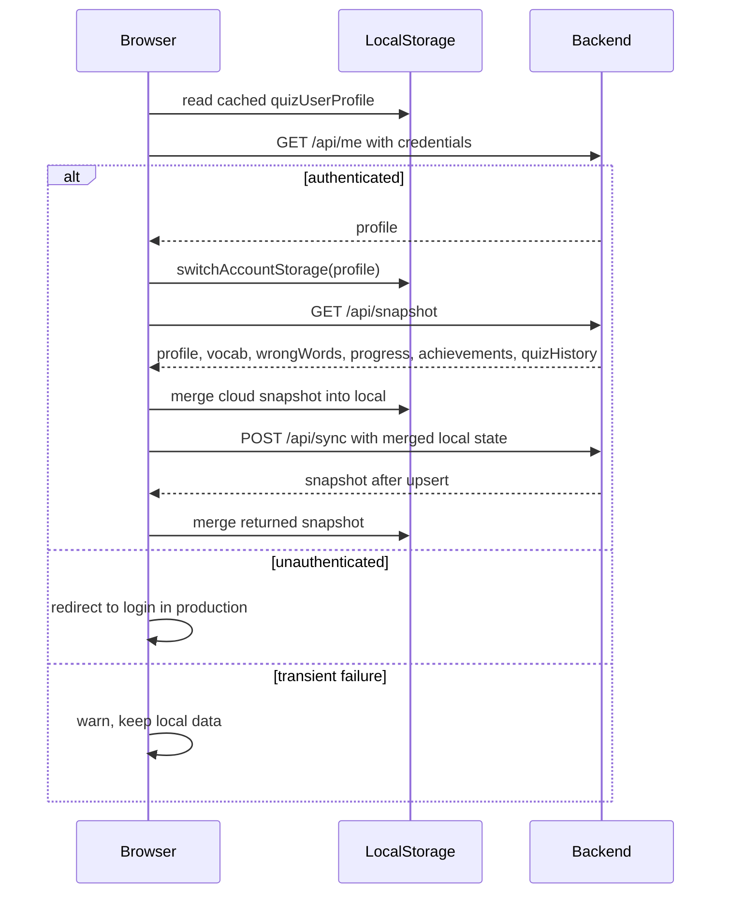
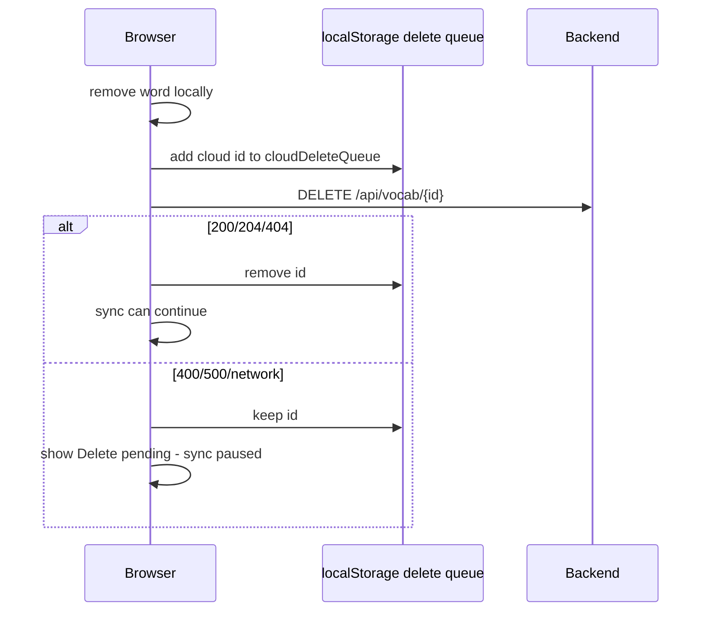

# WordArena Sync Hardening Audit

Date: 2026-06-08

Update: 2026-07-30 - P0 business integrity lockdown changed the backend trust
boundary for quiz and sync progress data. `/api/quiz-results` now recomputes
totals, correctness, score, combo, XP, stats, wrong-bank state, and
score-driven achievements from server-owned vocabulary answers. `/api/sync`,
`POST /api/vocab`, `PUT /api/vocab/{id}`, starter import, and wrong-word sync
continue to accept editable word content, but ignore client-supplied
`mastered`, `stats`, and wrong-bank mastery/progress fields. Sections below
describe the original audit; where they mention client stats overwriting server
stats, that behavior has been superseded by the July 30 lockdown.

## Scope

This is an audit-first reliability review of WordArena sync behavior. No sync code, storage format, backend API contract, database schema, or production data was changed.

The goal is to answer: can WordArena preserve user vocabulary data safely under real production conditions?

Short answer: the current architecture is salvageable for a focused learning app, but it is not a true multi-device conflict system. It is local-first with cloud snapshot/upsert behavior, a per-account localStorage namespace, and a separate pending delete queue. The most important risks are stale client overwrite, timestamp trust, delete queue/account coupling, and offline review progress conflict.

## Files Audited

Frontend:

- `frontend/js/app.js`
- `frontend/js/storage.js`
- `frontend/js/vocab.js`
- `frontend/js/review-today.js`
- `frontend/js/analytics-dashboard.js`
- `frontend/js/learning-studio.js`
- `frontend/js/config.js`

Backend:

- `backend/src/main/java/com/quizapp/vocab/VocabularyController.java`
- `backend/src/main/java/com/quizapp/vocab/VocabularyService.java`
- `backend/src/main/java/com/quizapp/vocab/SyncRequest.java`
- `backend/src/main/java/com/quizapp/vocab/SyncResponse.java`
- `backend/src/main/java/com/quizapp/vocab/WordRequest.java`
- `backend/src/main/java/com/quizapp/vocab/WordDto.java`
- `backend/src/main/java/com/quizapp/vocab/WordStatsDto.java`
- `backend/src/main/java/com/quizapp/review/ReviewController.java`
- `backend/src/main/java/com/quizapp/review/SpacedRepetitionService.java`

## Current Sync Architecture

WordArena uses local-first storage and cloud sync when authenticated.

High-level model:

- Frontend local data lives in `localStorage`.
- Account data is scoped by email using `quizAccount:<accountId>:<key>`.
- Production auth is session-based through backend Google OAuth and `JSESSIONID`.
- Frontend verifies auth with `GET /api/me`.
- Frontend pulls cloud state with `GET /api/snapshot`.
- Frontend pushes cloud state with `POST /api/sync`.
- Individual frontend create/update/delete operations also try direct cloud APIs.
- Deletes use `DELETE /api/vocab/{id}` and a local pending delete queue.
- Backend `/api/sync` upserts words by normalized English, not by client revision.

## Sequence Flow

### App Startup And Login

Important code:

- `frontend/js/app.js`: `fetchCurrentUserWithRetry`, `loadAuthenticatedProfile`, `pullCloudSnapshot`, `syncCloudNow`
- `frontend/js/storage.js`: `switchAccountStorage`, `save`, `accountStorageKey`

### First Cloud Sync After Login

Flow:

1. `loadAuthenticatedProfile()` authenticates with `/api/me`.
2. `cloudSyncReady = true`.
3. `pullCloudSnapshot()` runs before the first push.
4. `applyServerSnapshot()` merges cloud words into local lists.
5. If pull succeeds, `syncCloudNow()` pushes merged local state to `/api/sync`.

Reliability implication:

- A fresh empty browser is unlikely to wipe cloud state immediately because initial sync pulls before pushing.
- If snapshot fails, `syncCloudNow()` is not called from the login path.
- Later UI-triggered sync calls can still push whatever is local once `cloudSyncReady` is true.

### Local Save

Flow:

1. Local operations modify global `vocab` and `wrongWords`.
2. `save()` writes to account-scoped `localStorage`.
3. UI rerenders.
4. Cloud write is attempted if `window.quizCloud` is ready.

Important code:

- `frontend/js/storage.js`: `save()`
- `frontend/js/vocab.js`: add/edit/delete/favorite/known/hard flows
- `frontend/js/review-today.js`: `persistLocalWords()`
- `frontend/js/learning-studio.js`: `importWordsToVocabulary()`

### Cloud Snapshot Pull

Flow:

1. `pullCloudSnapshot()` first calls `flushPendingCloudDeletes()`.
2. If delete queue cannot flush, snapshot pull stops.
3. Frontend fetches `/api/snapshot`.
4. Snapshot is merged into local state with `mergeWordLists()`.
5. LocalStorage is saved.

Merge direction:

- Local list is loaded first into a `Map`.
- Cloud words are then merged by normalized English key.
- For matching words, `chooseMergedWord(local, cloud)` picks based on `updatedAt`, `updated_at`, `stats.lastReviewed`, or `stats.nextReview`.
- If timestamps tie or both missing, cloud wins.

### Cloud Push

Flow:

1. `syncCloudNow()` first calls `flushPendingCloudDeletes()`.
2. If deletes remain, sync stops.
3. Frontend sends profile, all vocab, and all wrongWords to `/api/sync`.
4. Backend applies profile.
5. Backend upserts every vocabulary item by normalized English.
6. Backend upserts wrong-bank entries by normalized English and sets mastered state.
7. Backend returns a full snapshot.
8. Frontend merges returned snapshot.

Backend merge direction:

- `/api/sync` does not compare timestamps.
- Last request processed by the server wins for all fields of each normalized English word.
- Deletes are not represented in `/api/sync`.

### Delete Flow

Important code:

- `frontend/js/app.js`: `cloudDeleteQueueKey`, `readPendingCloudDeletes`, `writePendingCloudDeletes`, `queuePendingCloudDelete`, `flushPendingCloudDeletes`, `deleteCloudWord`
- `frontend/js/vocab.js`: `deleteWord`
- `backend VocabularyService.deleteWord`: idempotent own-user delete, no cross-user delete

Current backend behavior is now safe for stale/missing IDs:

- If the word exists for the current user, delete it.
- If the word does not exist for the current user, return success/no error.
- This prevents stale delete IDs from blocking sync forever because of missing backend rows.

## Sync Entry Points

### Auth Bootstrap

Trigger source:

- App load.

Frontend path:

- `loadAuthenticatedProfile()`
- `fetchCurrentUserWithRetry()`
- `/api/me`

Local writes:

- Applies cached profile in local/dev mode.
- Switches account storage after authenticated profile.

Cloud writes:

- None directly, but successful auth triggers snapshot pull and then sync push.

Failure handling:

- 401/403 or `authenticated:false`: production redirects to login.
- 500/network/transient: retries, then warns without clearing local data.

Risk:

- Low/medium. Recent retry behavior makes false logout less likely.

### Snapshot Pull

Trigger source:

- Successful login.
- `scheduleCloudSync()` when `cloudSnapshotPulled` is false.
- Manual `window.quizCloud.pullNow`.

Local writes:

- Merges cloud vocab/wrongWords into local.
- Saves localStorage.
- Applies profile/progress/achievements.

Cloud writes:

- None.

Overwrite rules:

- Per-word merge by normalized English.
- Newer timestamp wins; cloud wins ties/missing timestamps.

Failure handling:

- Non-ok response sets "Cloud unavailable".
- Network error sets "Offline/local mode".
- Pending delete queue blocks pull.

Risk:

- Medium. Pull itself is conservative, but merge can prefer stale cloud if local timestamp is missing or invalid.

### Full Cloud Sync Push

Trigger source:

- After successful initial snapshot pull.
- Debounced local changes through `scheduleCloudSync()`.
- Manual Studio sync button.
- Imports and Learning Studio imports.

Local writes:

- Merges returned server snapshot back into local.

Cloud writes:

- Sends all local vocab and wrongWords to `/api/sync`.

Overwrite rules:

- Backend upserts by normalized English.
- Backend does not compare client and server timestamps.
- Every incoming word request can overwrite existing server fields.

Failure handling:

- Non-ok response sets "Cloud unavailable".
- Network error sets "Offline/local mode".
- Pending delete queue blocks sync.

Risk:

- High for multi-device stale overwrite. This is the biggest architectural risk in the current sync model.

### Direct Cloud Create

Trigger source:

- Adding a word while cloud ready.

Cloud writes:

- `POST /api/vocab`.

Overwrite/duplicate rules:

- Backend normalizes English whitespace and rejects duplicates case-insensitively.

Failure handling:

- Returns null on failure; local save remains.

Risk:

- Low/medium. Local-first behavior is safe, but failed creates rely on later full sync to reconcile.

### Direct Cloud Update

Trigger source:

- Editing fields, toggling favorite, marking known/hard.

Cloud writes:

- `PUT /api/vocab/{id}` if the local word has a server id.

Overwrite rules:

- Backend updates the word found by id and user.
- Duplicate English is rejected.

Failure handling:

- Returns null on failure; local save remains.

Risk:

- Medium. If PUT fails, later `/api/sync` may upsert by English and overwrite cloud based on local state.

### Direct Cloud Delete

Trigger source:

- Deleting a word in vocabulary table.

Local writes:

- Removes local vocab immediately.
- Removes matching wrongWords by English.
- Adds server id to delete queue.

Cloud writes:

- `DELETE /api/vocab/{id}`.

Failure handling:

- Queue persists until success, 404, or now idempotent backend success.
- Any remaining queue pauses snapshot and sync.

Risk:

- Medium. Backend idempotency fixed the worst stuck state. Remaining risk is account-switch queue ambiguity and no max retry/diagnostic metadata.

### Review Queue Fetch

Trigger source:

- Opening review screen or review refresh.

Cloud reads:

- `GET /api/review/queue?limit=8`.

Local writes:

- None on fetch.

Failure handling:

- Falls back to local due queue.

Risk:

- Low for availability, medium for consistency because cloud/local queues can diverge.

### Review Answer

Trigger source:

- User answers review item.

Cloud writes:

- If source is cloud, sends `POST /api/review/answer`.

Local writes:

- Always applies local stats update through `applyLocalAnswer()`.

Failure handling:

- If cloud answer fails, local progress is saved and the user sees a warning.

Risk:

- High for offline review conflict. Local review progress can later be pushed through full sync and overwrite newer cloud stats because there is no server revision or monotonic review event log.

### Analytics

Trigger source:

- Dashboard/analytics refresh.

Cloud reads:

- `/api/analytics/overview`
- `/api/analytics/accuracy-trend`
- `/api/analytics/weak-words`
- `/api/analytics/review-pressure`
- `/api/analytics/tag-performance`

Local writes:

- None.

Failure handling:

- Falls back to local analytics.

Risk:

- Low for data safety. Analytics may show different cloud/local results during sync instability.

### Imports And AI Deck Imports

Trigger source:

- JSON import, starter import, CSV import, AI deck import.

Local writes:

- Merge or replace current local vocabulary.
- Stamps imported words with client `updatedAt`.

Cloud writes:

- Calls `syncCloudNow()` or admin sample import.

Overwrite rules:

- Merge mode skips duplicates by normalized English.
- Replace mode replaces local data, then later sync can push replaced local state upward. Because `/api/sync` does not delete missing cloud words, replace mode does not truly remove cloud words unless deletes happen separately.

Risk:

- Medium. Merge mode is safer than replace. Replace language may imply cloud replacement, but backend sync is upsert-only.

## Merge Rules

Frontend word identity:

- `wordMergeKey()` prefers normalized English key.
- If English is missing, it falls back to id.
- Valid merged words require both `eng` and `vie`.

Frontend winner selection:

- Compare parsed timestamp from:
  - `updatedAt`
  - `updated_at`
  - `stats.lastReviewed`
  - `stats.nextReview`
- If both sides have times: newer wins.
- If only one side has a time: timed side wins.
- If neither side has time: cloud wins.

Backend word identity:

- `/api/sync` uses normalized English, not id.
- Normalization trims and collapses whitespace; duplicate lookup is case-insensitive.
- Backend stores normalized whitespace but preserves casing.

Backend overwrite behavior:

- `/api/sync` applies the incoming request fields to the server word.
- No timestamp comparison happens in `VocabularyService.sync()`.
- No delete semantics happen in `/api/sync`.

## Timestamp Trust Audit

Current timestamp sources:

- Frontend stamps local changes with `new Date().toISOString()`.
- Frontend review offline updates use client time.
- Backend entity `updatedAt` uses server time through JPA lifecycle callbacks.
- Backend review answer uses server `Instant.now()`.
- Backend `/api/sync` receives stats timestamps from the client and stores them.

Risks:

- Client clock drift can make stale local changes look newer during frontend snapshot merge.
- Backend `/api/sync` does not reject future `stats.lastReviewed` or future `nextReview`.
- `WordStatsDto.lastReviewed` has `@PastOrPresent`, but `nextReview` can be future by design.
- `updatedAt` is not part of `WordRequest`, so the frontend cannot tell the backend "only apply this if newer".
- Null or missing timestamps cause cloud to win on pull, but later push can still overwrite cloud if local state remains and sync is manually triggered.

Risk level:

- High for simultaneous edits and stale devices.
- Medium for ordinary single-device usage.

Recommended posture:

- Treat client timestamps as hints, not authority.
- Prefer server `updatedAt` for cloud conflict decisions.
- Add defensive frontend guards before pushing stale local snapshots.

## Delete Queue Audit

Storage key:

- Base key is `cloudDeleteQueue`.
- Actual key is account-scoped through `accountStorageKey("cloudDeleteQueue")` when available.

Lifecycle:

1. Delete local word.
2. Queue server id.
3. Try DELETE immediately.
4. Before every snapshot pull or sync push, flush queue.
5. Keep failed IDs.
6. Pause sync if any remain.

Cleanup:

- Success clears id.
- 404 clears id.
- Current idempotent backend missing/foreign-user success also clears id.
- 400/500/network keeps id.

Can queue grow forever?

- Yes, if repeated network/server/auth failures persist.
- Queue stores only ids, no timestamps, retry count, account marker, or reason.

Can queue block sync forever?

- Previously yes for stale IDs returning 400.
- After idempotent backend delete, less likely.
- Still possible if auth/session is broken, backend stays 500, CORS fails, or queue belongs to wrong account and all deletes return non-ok.

Can queue survive account switching incorrectly?

- Mostly scoped by cached profile email, but account identity depends on `quizUserProfile`.
- If cached profile is wrong, missing, or changes during auth bootstrap, queue lookup can happen under the wrong account namespace.

Risk level:

- Medium after idempotent delete fix.

## Multi-Device Safety Scenarios

### Case 1 - Old Laptop Overwrite

Scenario:

- Device A adds or edits vocabulary today and syncs.
- Device B opens after two weeks offline with stale local data.

Current behavior:

- On login, Device B pulls snapshot first and merges.
- If pull succeeds, cloud data should merge into local before push.
- If local stale words have newer/future client timestamps, frontend may prefer stale local fields.
- Backend push then upserts Device B's merged local state without server-side timestamp checks.

Answer:

- Old local state usually will not wipe the cloud immediately because pull comes first.
- It can still overwrite newer cloud fields if local timestamps are wrong or if a manual/full sync happens after a failed pull.

Risk:

- High.

Small safe improvement:

- Add a "do not push until a successful snapshot pull" guard for manual/import/studio sync paths, not just scheduled sync.
- Track a per-account `lastSuccessfulSnapshotAt` and warn instead of pushing after long offline gaps.

### Case 2 - Empty Local Wipe

Scenario:

- Fresh browser or cleared localStorage opens authenticated.

Current behavior:

- Initial login pulls snapshot first.
- Empty local then merges cloud into local.
- `/api/sync` pushes merged state.
- Since backend `/api/sync` is upsert-only, sending empty arrays would not delete cloud words anyway.

Answer:

- Empty local should not wipe cloud vocabulary under the current API because sync does not delete missing words.

Risk:

- Low for wipe, medium for confusing local UI if snapshot fails and cloud is unavailable.

Small safe improvement:

- Keep the current pull-before-push behavior.
- Add clearer status when the app is authenticated but snapshot has not yet completed.

### Case 3 - Delete Replay

Scenario:

- Delete queued locally.
- Cloud delete fails.
- User reloads/login/logout.

Current behavior:

- Queue persists in localStorage.
- Snapshot and sync are paused until queue flushes.
- Backend now treats missing own word as already deleted, so stale IDs can clear.

Can deleted words reappear?

- If local delete happened but cloud delete never succeeded, snapshot pull is blocked by queue. This prevents the cloud copy from being pulled back immediately.
- If queue is lost or under the wrong account key, the cloud word can reappear on next snapshot pull.

Can queue become permanently stuck?

- Less likely after backend idempotency.
- Still possible with repeated auth/CORS/backend failures or wrong account namespace.

Risk:

- Medium.

Small safe improvement:

- Store queue entries as objects with `id`, `queuedAt`, `attempts`, and last status, while preserving backward compatibility with existing string arrays.

### Case 4 - Duplicate Merge Drift

Scenario:

- Same word exists with different casing, spacing, or edited on two devices.

Current behavior:

- Frontend merge uses normalized English key: trim, lowercase, collapse whitespace.
- Backend sync upsert also normalizes whitespace and compares case-insensitively.
- Backend create/update rejects duplicates.

Can duplicates survive?

- Existing production duplicates from schema drift can survive in database if they already exist.
- Frontend snapshot merge may collapse them visually by normalized English key, but backend list can still contain duplicate rows.
- Stats can split across duplicate database rows if production already has drift.

Risk:

- Medium/high until Supabase duplicate inspection is completed.

Small safe improvement:

- Add a backend audit/log warning or test around duplicate normalized rows.
- Do not auto-merge production duplicates without manual review.

### Case 5 - Simultaneous Edits

Scenario:

- Two tabs/devices edit the same word.

Current behavior:

- Direct PUT by id updates server immediately if online.
- Later full sync from either device can overwrite fields by normalized English.
- No version, ETag, or "updated since" guard exists.

Which version wins?

- On server, last request processed wins.
- On frontend pull merge, the word with the newest parsed timestamp wins.

Is `updatedAt` trustworthy enough?

- Good enough for ordinary single-device freshness.
- Not trustworthy enough for robust multi-device conflict resolution because client clocks and stale local timestamps are involved.

Risk:

- High for concurrent power users.

Small safe improvement:

- Avoid silently overwriting if local word timestamp is older than server `updatedAt` from the last pulled snapshot.

### Case 6 - Offline Review Progress

Scenario:

- User reviews words offline.
- Later sync resumes.

Current behavior:

- Local stats are updated with client time.
- Cloud review answer is skipped/fails.
- Later full sync sends local stats to `/api/sync`.
- Backend applies incoming stats directly.

Can later sync corrupt review scheduling/streak/mastery?

- Yes. Offline progress can overwrite newer cloud stats from another device.
- Future or incorrect client clocks can shift `nextReview`.

Risk:

- High.

Small safe improvement:

- Clamp obviously invalid stats/timestamps in backend sync.
- Prefer max counters for seen/correct/wrong/bestStreak where safe, rather than blind replacement.
- Avoid changing scheduling architecture until this is separately tested.

## Failure Mode Audit

### Backend Offline Or Render Cold Start

Current behavior:

- `/api/me` retries before deciding transient failure.
- Snapshot/sync set "Cloud unavailable" or "Offline/local mode".
- Local app remains usable.

Risk:

- Low/medium. UX is acceptable after recent auth stabilization.

### Supabase Latency Or 500

Current behavior:

- Frontend treats non-ok snapshot/sync as cloud unavailable.
- Local state is preserved.
- Analytics/review use local fallback.

Risk:

- Medium. Repeated 500s can pause cloud confidence and leave local/cloud divergent.

### OAuth Expired Session

Current behavior:

- `/api/me` 401/403 redirects in production.
- Other endpoints returning 401/403 are generally classified as request failure/null, not always explicit login-required.

Risk:

- Medium. Direct sync failures do not clearly distinguish unauthenticated from backend unavailable.

### CORS Temporary Failure

Current behavior:

- Fetch throws; auth bootstrap warns and keeps local data.
- Sync/snapshot fall back to local/offline status.

Risk:

- Low for data loss, medium for user confusion.

### Malformed Snapshot Response

Current behavior:

- `await response.json()` is inside try/catch, so malformed JSON becomes offline/local status.
- `applyServerSnapshot()` ignores missing arrays.

Risk:

- Low/medium.

### localStorage Failure

Current behavior:

- Delete queue write catches quota errors.
- General `save()` does not catch localStorage errors.

Risk:

- Medium. Private browsing/quota issues can break local persistence outside delete queue.

## Risky Files And Functions

Highest risk:

- `frontend/js/app.js`
  - `syncCloudNow()`
  - `pullCloudSnapshot()`
  - `scheduleCloudSync()`
  - `applyServerSnapshot()`
  - `chooseMergedWord()`
  - `mergeWordLists()`
  - `flushPendingCloudDeletes()`
  - `deleteCloudWord()`
- `backend/src/main/java/com/quizapp/vocab/VocabularyService.java`
  - `sync()`
  - `upsertByEnglish()`
  - `applyWordRequest()`
  - `deleteWord()`
- `frontend/js/review-today.js`
  - `postAnswer()`
  - `applyLocalAnswer()`
  - `answerItem()`

Medium risk:

- `frontend/js/storage.js`
  - `switchAccountStorage()`
  - `save()`
  - `accountStorageKey()`
- `frontend/js/vocab.js`
  - `saveEditedWord()`
  - `syncWordUpdate()`
  - `deleteWord()`
  - `markWordKnown()`
  - `markWordHard()`
- `frontend/js/learning-studio.js`
  - `importWordsToVocabulary()`
  - `mergeWordsWithImportStats()`

Low risk:

- `frontend/js/analytics-dashboard.js`
  - read-only cloud fallback behavior

## Biggest Production Risks

1. Stale multi-device overwrite because backend `/api/sync` blindly applies incoming fields.
2. Client timestamp trust because frontend merge uses local `updatedAt`, `lastReviewed`, and `nextReview`.
3. Offline review progress conflict because local review stats can later overwrite newer cloud stats.
4. Delete queue can still block sync during repeated auth/backend/CORS failures and lacks diagnostics.
5. Existing production duplicate normalized words can split stats and confuse merge.
6. Account-scoped localStorage depends on cached profile email, so bootstrap/account switching deserves care.
7. `/api/sync` has no delete semantics, so "replace import" does not truly replace cloud data.

## Safest Immediate Fixes

### 1. Guard all full sync pushes until snapshot has been pulled

Risk level: Low

Expected benefit:

- Reduces stale laptop and manual sync overwrite risk.

Implementation complexity:

- Small frontend change.

Schema change required:

- No.

Notes:

- `scheduleCloudSync()` already tries to pull first.
- Manual `window.quizCloud.syncNow()`, import flows, and Studio sync can call `syncCloudNow()` directly. Add a defensive guard inside `syncCloudNow()` itself: if `cloudSnapshotPulled` is false, attempt pull and only push after success.

### 2. Add stale-local warning before pushing after long offline gaps

Risk level: Low/medium

Expected benefit:

- Gives the user a chance to avoid overwriting cloud with old local data.

Implementation complexity:

- Small frontend change.

Schema change required:

- No.

Notes:

- Store per-account `lastSuccessfulSnapshotAt`.
- If last snapshot is older than a threshold, pull first and show a non-destructive warning on failure.

### 3. Make delete queue entries diagnostic-compatible

Risk level: Low

Expected benefit:

- Easier production debugging without clearing queues blindly.

Implementation complexity:

- Small frontend change with backward compatibility.

Schema change required:

- No.

Notes:

- Continue reading existing string arrays.
- Write future entries as `{ id, queuedAt, attempts, lastStatus }`.

### 4. Distinguish auth failure from cloud failure in sync requests

Risk level: Low

Expected benefit:

- Avoids treating 401/403 like generic backend outage.

Implementation complexity:

- Small frontend change.

Schema change required:

- No.

Notes:

- `requestJson()`, `pullCloudSnapshot()`, `syncCloudNow()`, and `flushPendingCloudDeletes()` can display a session-expired message without clearing local data.

### 5. Clamp unsafe sync stats on backend

Risk level: Medium

Expected benefit:

- Prevents malformed/offline client stats from corrupting review state.

Implementation complexity:

- Small to medium backend change with targeted tests.

Schema change required:

- No.

Notes:

- Counts should stay non-negative.
- `masteryLevel` should stay 0-5.
- Future `lastReviewed` should be rejected or clamped.
- Very far future `nextReview` should be treated carefully.

### 6. Make backend sync less destructive for stats

Risk level: Medium

Expected benefit:

- Reduces offline review conflicts.

Implementation complexity:

- Medium and requires careful tests.

Schema change required:

- No.

Notes:

- Consider max/monotonic handling for `seen`, `correct`, `wrong`, `bestStreak`.
- Be careful with `currentStreak`, `masteryLevel`, and `nextReview`; these are not simply monotonic.
- Do not implement without targeted conflict tests.

### 7. Add sync regression tests for stale and delete cases

Risk level: Low

Expected benefit:

- Prevents future accidental regressions.

Implementation complexity:

- Small to medium.

Schema change required:

- No.

Candidate tests:

- Initial sync pulls before push.
- Stale delete ID clears after idempotent backend delete.
- Duplicate normalized English does not create a second backend word.
- Offline review sync with invalid stats is handled safely after backend clamp work.

## Dangerous Fixes To Avoid

- Do not clear `localStorage` or delete queues automatically.
- Do not add delete semantics to `/api/sync` without a migration and strong UI confirmation.
- Do not introduce CRDT/event sourcing/WebSockets for this project phase.
- Do not merge production duplicate words automatically.
- Do not trust client timestamps as authoritative conflict resolution.
- Do not add database tables for revisions until smaller guards are exhausted.
- Do not make `/api/sync` reject whole payloads for one bad word without a compatibility plan.

## Is The Current Architecture Salvageable?

Yes. For a focused vocabulary learning app, the current local-first architecture can be made production-safe enough with small guardrails.

It is not suitable for strong multi-device conflict guarantees. That is acceptable if product expectations are framed as "local-first with cloud backup/sync" rather than "real-time multi-device collaborative editing."

The safest path is incremental hardening:

- protect against stale pushes,
- improve delete queue diagnostics,
- clamp bad stats,
- add regression tests,
- inspect production drift/duplicates,
- only then consider more formal versioning if real user behavior demands it.

## Recommended Order Of Future Hardening Work

1. Add a guard inside `syncCloudNow()` so every full push requires a successful snapshot pull first.
2. Add per-account `lastSuccessfulSnapshotAt` and status copy for stale/offline recovery.
3. Upgrade delete queue storage to include attempts/status while reading old string arrays.
4. Add frontend tests for first-pull-before-push and delete queue clearing behavior.
5. Add backend validation/clamping tests for sync stats.
6. Run Supabase duplicate/null/orphan inspection from the schema drift audit.
7. Add backend sync conflict tests before changing stats merge behavior.
8. Plan Flyway baseline only after production data inspection is clean.

## Current Reliability Verdict

Single-device usage: Good after recent auth/delete/schema hardening.

Offline local usage: Good for preserving local data, medium risk for later cloud reconciliation.

Multi-device usage: Risky. The app avoids the most obvious empty wipe, but stale overwrites remain possible.

Delete safety: Much improved after idempotent backend delete, but queue diagnostics are still weak.

Production readiness: Improving, but not fully mature. The next work should be guardrails and tests, not new features.
# 2026-07-31 Sync V2 Follow-Up

Implemented hardening items:

- `SyncService` requires `syncContractVersion: 2`.
- `expectedRevision` is required; stale revisions return `409 SYNC_REVISION_CONFLICT` before mutation.
- Full sync locks the `AppUser` row with pessimistic write locking.
- Sync identity is `wordUid`, not English.
- `wrongWords` request data is ignored for upsert/create.
- Deletions are modeled as `deletions: [{ wordUid }]`.
- Tombstones are returned in snapshots and override live payloads.
- Tombstones include nullable `legacyWordId` so upgraded legacy devices can remove deleted local words before they ever adopted the server `wordUid`.
- Revision increments at most once per sync and does not increment for idempotent repeated deletes/no-op tombstone payloads.

Remaining operational gap: a real staging database rehearsal was not executed locally in this workspace. CI now provides PostgreSQL migration plus Hibernate validate coverage.
